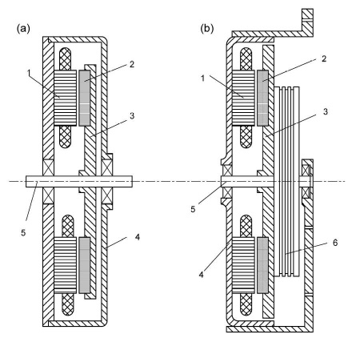
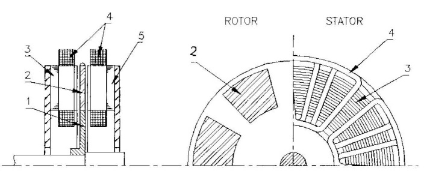
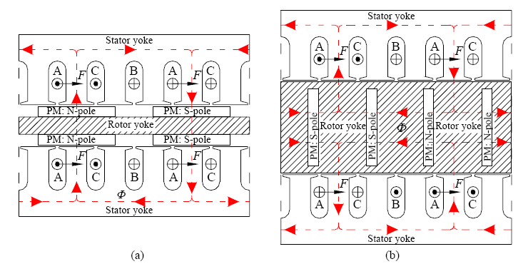
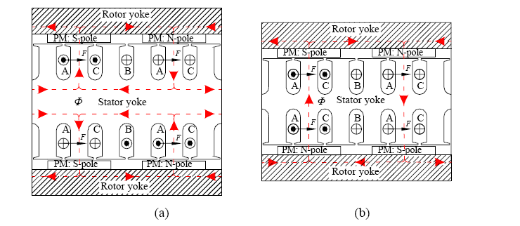

AFPM-gieras
===========

1.	GİRİŞ

1.1.	Kapsam

Bu kitapta adı geçen eksenel akılı sürekli mıknatıslı (EASM) makineler sadece disk tipte rotorlu sürekli mıknatıslı makinelerden bahsetmektedir.

1.2.	 Özellikler

Disk tip makine olarak da bilinen EASM makine, tıkız yapısı ve yüksek güç yoğunluğundan dolayı, silindirik RASM makinenin daha iyi bir alternatifidir. EASM motorlar bilhassa elektrikli araçlar, pompalar, fanlar, vana kontrolü, santrifüjler, makine elemanları, robotlar ve endüstriyel ekipmanlar için uygundur. Daha büyük çapta tasarlanabilen rotor ile eylemsizlik momenti sayesinde volan olarak kullanılabilir. EASM makineler küçük ve orta ölçekte güç üretiminde de kullanılabilmektedirler. Çok kutuplu yapılabilmelerinden dolayı bu makineler elektromekanik çekiş sürücüleri, vinçler veya rüzgar türbinleri gibi düşük hız uygulamaları için uygundur.

Disk şeklindeki rotor ve statoru sayesinde, birbirinden farklı özelliklere sahip, değiştirilebilir tasarımlar yapmak mümkündür. EASM makineleri tek hava aralıklı veya çok hava aralıklı, oluklu veya oluksuz hatta tamamen demirsiz endüvili şekilde tasarlanabilir. Düşük güçteki EASM makineleri genellikle oluksuz sargılı ve yüzey sürekli mıknatıslı şekilde tasarlanmaktadır. EASM makinelerinin çıkış gücü arttıkça, rotor ile şaft arasındaki temas yüzeyindeki güç azalır. Burada rotor ve şaftın mekanik tasarımı yapılırken dikkat edilmesi gerekir aksi takdirde büyük ihtimalle disk tip makinelerde sorun olacaktır.

Bazı durumlarda, parça sayısını, hacmi, kütleyi, güç transferini ve bağlantı zorluğunu optimize etmek için rotor güç iletim parçasına gömülür. Örneğin; teker motorlu elektrikli araçlar için verimli ve düşük maliyetli güzel bir çözümdür.

1.3.	EASM Makinelerinin Türleri

Esas itibariyle, her bir tip radyal akılı makineye tekabül eden eksenel akılı bir karşılığı vardır. Pratikte disk tip makineler şu üç tiple sınırlıdır:

- SM DA Komütatör makineler;
- SM fırçasız DA ve senkron makineler;
- İndüksiyon makineleri

EASM DA komütatör motorlar fan, küçük elektrikli araçlar, el aletleri vs. gibi endüstriyel, otomotiv ve yerel uygulamalarda halen çok yönlü ve ekonomik bir seçenektir.
Pratik olarak, DA fırçasız ve AA senkron makineler her ne kadar teori ve çalışma prensipleri bakımından biraz farklı olsa da, aynı yapıya sahiptirler. Esas fark çalışırkenki akım dalga formunun farklı olmasıdır. DA akım fırçasız makineler kare dalga formu ile çalışırken, AA senkron makineler sinüzoidal dalga formu ile çalışmaktadır (Şekil var sayfa6).

Disk tip indüksiyon makineler için kafes sargılı lamine rotor üretmek zordur. Bundan dolayı şimdiye kadar disk tip indüksiyon makinelerine ilgi olmamıştır.

1.4.	Topoloji ve Geometriler

Eksenel akılı sürekli mıknatıslı makinelerin yapımları açısından bakıldığında tek yanlı ya da çift yanlı, oluklu ya da oluksuz endüvili, rotor ortada veya dışarıda, mıknatıslar gömülü veya yüzeye yapıştırmalı ve tek katmanlı veya çok katmanlı olarak tasarlanabilir (Şekil var aşağıdaki şema).

Eksenel akılı makineleri eksenel olarak yönlenmiş hava aralığı akısı dağılımına sahiptir. Genellikle stator yüzük yapıda, rotor disk şeklindedir. Etkin iç ve dış çapları birçok yapıda birbirine eşittir. Statorun iç çapından dış çapına kadar olan radyal uzunluğu; motorun torku üreten etkin kısmıdır. Eksenel uzunluk stator ile rotor arasındaki akı yoğunluğuna bağlıdır. Böylece uygun bir çift tasarımı ile hem rotordan hem statordan tamamen faydalanılabilir. Bu nedenle, eksenel akılı motorun etkin radyal kısmını değiştirmeden kutup sayısını artırdığınızda, eksenel uzunluk azalır ve güç yoğunluğu artar.
 
Şekil 1.1 Muhtelif fırçasız EASM makine topolojileri

Tek rotor ve tek statorlu yapı en basit eksenel akılı sürekli mıknatıslı makine yapılanışıdır(şekil var sayfa7). Bu yapının eksi yönü rotor ile stator arasındaki düzensiz kuvvetler neticesinde daha karmaşık ve kalın mil ayrıca daha kalın rotor yapılması gerekmektedir. 

Tek stator iki rotorlu yapı, faz sarımları oluklu veya oluksuz stator etrafına sarılmış ve rotorlarda iki yanına yerleştirilmiş yapıdır(şekil sayfa7). Bu yapıya “TORUS” tipi eksenel akılı makineler de denmektedir.  İlk TORUS tipi sürekli mıknatıslı makine 1980 sonlarında oluksuz stator yapıda gerçekleştirildi. Toroid şeklinde sarılmış faz sarımları makine verimliliğini ve güç yoğunluğunu artırmak için kısa devre yapılmıştı. Bir mahsuru, statoru yapıya sabitlemek çok daha karmaşıktır. Ayrıca rotorun statorların arasında olduğu zıttı yapı ile karşılaştırılırsa sarımlar için daha az yer kalır. 

Birkaç makineyi aynı şaft üzerine yerleştirerek daha karmaşık düzenlemeler bulunabilir(şekil sayfa10). Çoğu makineler gemi tahrik sürücüsü, pompa ve yüksek hızlı sürekli mıknatıslı jeneratör uygulamalarında ve araştırma amacıyla uygulanabilir. 

Rotordaki mıknatısların düzenleri ile ilgili olarak farklı varyasyonlar da bulunabilir. Mıknatısların düzeni stator ile rotor arasındaki esas akı yoluna etki eder, pekala sarım yapılanışı ile de mümkündür. 

1.5.	Uygulamalar

1.6.	EASM Makineleri ile RASM Makinelerinin Karşılaştırılması

Yeni malzemelerin uygulamaları, üretim teknolojilerindeki buluşlar ve soğutma tekniklerindeki gelişmeler elektrik makinelerinin güç yoğunluğunun (hacim veya kütlenin çıkış gücüne oranı) daha da artmasını olanaklı kılmıştır. Geleneksel RASM makineleri için bu artışın, yapılarından kaynaklanan, sınırları vardır. Çünkü:

- Dış rotorlu indüksiyon ve DA komütatör makineler veya fırçasız makineler açısından rotor dişindeki ana akı yolu bir darboğaz oluşturur (Şekil var);
- Şaft etrafındaki çoğu rotor çekirdeğini manyetik devre olarak kullanmak çok zordur;
- Stator sargılarındaki ısı stator çekirdeğine oradan da dış çerçeveye iletilir. Stator hava aralığında çok zayıf ısı iletimi vardır.

Bu sınırlamalar radyal akılı yapıya sahip makineleri yapıdan kaynaklı olarak sınırlar ve yeni bir topoloji uygulanmadan kolay kolay giderilemez. EASM makine, RASM makineye göre daha yüksek güç yoğunluğuna sahiptir ve RASM eşdeğerine göre daha tıkız bir yapıya sahiptir, yani boyut olarak daha küçüktür.

Ayrıca, EASM makilerin iç çapı genellikle şaft çapından daha büyüktür(şekil sayfa7), bu sayede daha iyi bir hava akımı ve soğutma sağlanabilmektedir. Belirli uygulamalarda EASM makinenin özellikleri genelde RASM makineye göre daha fazla avantaj sağlamaktadır. Bunları şu şekilde sıralayabiliriz:

- EASM makineler, RASM makinelere göre çok daha büyük çap-uzunluk oranına sahiptir;
- EASM makineler düzlemseldir ve bazı yapılanmalarda ayarlanabilir hava aralığına sahiptir;
- Çekirdek malzemesini daha tasarruflu kullanacak şekilde tasarlanabildiği için daha yüksek güç yoğunluna erişebilir;
- Bir EASM makinenin topolojisi gereği parçalı olarak tasarlanabildiği için, aynı sayıda parçalar ile güç veya tork gereksinimleri ayarlanabilmektedir;
- Çekirdeğin dış çapının daha büyük ve daha fazla sayıda kutup ile tasarlanabildiğinden, EASM makineleri yüksek frekans veya düşük hız uygulamaları için yapmak mümkündür.

Şekil’de görüldüğü gibi RASM makine ile beş farklı güç seviyesinde EASM makinelerin performans karşılaştırmalarında EASM makinenin, verilen güç oranına göre daha küçük hacme ve daha az etkin malzeme ağırlığına sahiptir. (şekil makale008)

1.7.	EASM Makinelerinin Güç Sınırları

Şimdilerde EASM disk tip fırçasız makinelerin güç aralığı 1 Watt’tan daha küçük boyutlardan başlayıp yaklaşık Mega Watt mertebelerine kadar ulaşmaktadır. EASM makinenin çıkış gücü arttığı zaman rotor ile şaft arasındaki bağlantı yüzeyi, güce göre küçük kalmaya başlar. Çıkış gücünün daha yüksek olduğu aralıklarda rotor ile şaftın mekanik bütünlüğünü tasarlamak daha zordur. Rotor ile şaft arasındaki mekanik bütünlüğün yüksek güçlerde oluşturabileceği sorunu aşmak için genel çözüm çok katmanlı (multidisk) makine tasarlamaktır. 

EASM makinenin tork kapasitesi çapın küpü ile doğru orantılı iken RASM makinenin tork kapasitesi çapın karesi ile doğru orantılıdır. Motorun güç seviyesi veya uzunluğunun çapına oranı arttığında eksenel akılı geometriye ilişkin avantajlar kaybolabilir. RASM makinenin uzunluğunun iki katı yarıçapa eşit olduğu noktada geçiş meydana gelir. Bu da, tek katmanlı disk makinenin güç oranı için sınırlı bir tasarım yapılmasına neden olur.

1.8.	 Cdc
2.	EASM Makinenin Çalışma İlkeleri
2.1.	Manayetik Devreler
2.2.	Sargılar
2.3.	Tork Üretimi
2.4.	Manyetik Akı
2.5.	Elektromanyetik Tork ve EMF
2.6.	Kayıplar ve Verimlilik
2.7.	Boyutlandırma Denklemleri
2.8.	Endüvi Reaksiyonları
2.9.	
3.	Malzemeler ve Üretim
4.	Stator Nüvesiz EASM Makineleri
5.	Kontrol
6.	Cc
7.	

1.1.	Stator Nüvesiz EASM Makineleri

1.1.1.	Ticari nüvesiz statorlu EASM makineleri

Bodine Electric Şirketi, Chicago, IL, U.S.A. 178-mm (7- inch) and 356-mm (14-inch) çapa sahip e-TORQ™ ve çekirdeksiz stator sargıları olan ve çelik arka disklere sahip ikiz harici PM rotorlu EASM motorlar üretir. Çekirdeksiz stator tasarımı, sözde çark torkunu elimine eder, düşük hız kontrolünü artırır, manyetik doyumsuzluğa bağlı doğrusal tork-akım karakteristiğini temin eder ve değerlendirilmiş torka göre on kata kadar yüksek tork sağlar. Motorlar, standart katı cisim konverterinden güç alsalar bile, aşırı düşük hızda çalışabilir. Buna ek olarak, belirli uygulamalarda, yüksek zirve tork kabiliyeti, yüksek maliyetli dişli kutularından ve yağ sızıntısı riskinden kaçınmayı sağlamaya izin verir.

356mm çaplı e-TORQ motorları, North Dakota State Üniversitesi öğrencileri tarafından, güneş arabasında direk itici güç (2003 American Solar Challenge (Fig. 5.1b)) olarak başarıyla kullanıldı. İyi tasarlanmış bir güneş aracı, maksimum miktarda güneş enerjisini, minimum miktarda dönme direnciyle mekanik enerjiye çevirebilmek için oldukça verimli ve hafif bir elektrik motoruna ihtiyaç duyar. Çekirdeksiz fırçasız EASM motorları bu gereklilikleri sağlar.

Küçük demirsiz motorlar, yazılı akım statoru sarmalları ya da film bobin sarmallarına sahiptir. Film sarmal statör bobinleri birçok bobin katmanına sahiptir, ancak yazılı akım sarmalları bir veya iki bobin katmanına sahiptir. Fig 5.12, EmBest, Soeul, Güney Kore tarafından üretilen bir demirsiz fırçasız film sarmal statör bobini göstermektedir. Bu motor, statorun bir tarafında, tek taraflı PM harekete geçirme sistemine ve diğer tarafında çelik destek sistemine sahiptir. Küçük film bobin motorları, bilgisayar çevresinde, bilgisayar hard diskinde, cep telefonlarında, çağrı cihazlarında, uçuş kayıt cihazlarında, kart okuyucularda, yazıcılarda, kopya makinelerinde, çizicilerde, mikrometrelerde, bandrol makinelerinde, video kaydedicilerde ve sağlık ekipmanlarında kullanılır.

1.1.	Eksenel Akılı Sürekli Mıknatıslı Motorların Topoloji ve Geometrisi

1.1.1.	Tek Rotor Tek Stator

Tek rotor ve tek statorlu yapı en basit eksenel akılı sabit mıknatıslı makine yapılanışıdır. Bu yapının bazı dezavantajlı tarafları vardır. Rotor ve stator arasındaki düzensiz kuvvetler neticesinde daha karmaşık bir mil yapısı ve daha kalın rotor diski gerekir. Bu yapıda tork üretim kapasitesi sınırlıdır. Şekil 1.6’da yüzeyde sürekli mıknatıslı rotor ve sıkıştırılmış elektromekanik çelik şeritler etrafına sarılmış statorlu tipik bir tek yüzlü fırçasız EASM makinesinin yapılanışı görülmektedir.

    : Şekil 1.6 Tek rotor tek statorlu makine: (a) endüstriyel ve elektromekanik çekiş sürücüleri için, (b) vinç uygulamaları için. 1- sıkıştırılmış stator, 2- SM, 3- rotor, 4- çerçeve, 5- mil, 6- kasnak

1.1.2.	Dış Statorlu veya İç Rotorlu
Sürekli mıknatıslı iç rotorlu çift yanlı eksenel akılı sürekli mıknatıslı makinelerde endüvi sargıları iki stator nüvesine yerleştirilirler. Sürekli mıknatıslı disk iki stator arasında döner. Sekiz kutuplu bir yapılanış Şekil 1.7’de görülmektedir. Sürekli mıknatıslar rotora gömülür veya yüzeyine yapıştırılır. Manyetik olmayan hava aralığı çok büyüktür. Statorları paralel bağlı çift yanlı makinenin bir stator sargıları kopsa dahi çalışabilir. Diğer taraftan eksenel çekim kuvvetlerine zıt ve eşit olan bir akı ürettiğinden seri bağlantı tercih edilir.

    : Şekil 1.7 İç disk rotorlu çift yüzlü fırçasız EASM makinenin yapılanışı: 1- rotor, 2- SM, 3- nüve, 4- stator sargıları.

Bu yapıda kalıcı mıknatıslar Şekil 1.9a’daki gibi rotor diskinin yüzeyine yerleştirilebilirler. Alternatif olarak mıknatıslar Şekil 1.9b’deki gibi rotorun içine yerleştirilebilir. Böylece ana akı eksenele olarak rotor boyunca akabilir veya rotor çevresi boyunca akabilir. 

Şekil 1.9a’daki yüzeye yerleştirilmiş yapı,  özellikle mıknatıslar ferromanyetik olmayan bir rotorun içine yerleştirilmişse, çok ince bir rotora sahiptir. Şekil 1.9b’deki sürekli mıknatısların rotor diskinin içine gömülü olduğu alternatif çözümde daha kalın bir rotor diski vardır ki bunun sonucu olarak makinenin stator yapısı temelde aynı kalırsa, güç yoğunluğu artar. Mıknatıslar ferromanyetik bir malzeme ile çevrildiğinde, yüzeye yerleştirilmiş yapı ile karşılaştırılırsa, mıknatısların sonunda sızıntı akısı büyüktür. Eğer kalınlık ve mıknatısların manyetizasyonu makine çapı boyunca sabitse, bazı zorluklar ortaya çıkar; makinenin iç çapına ve kutup çiftlerine bağlı olarak, iç yarıçaptaki mıknatıslar birbirine çok yakın olabilir. Bu, rotor nüvesinin iç yarıçapında aşırı doygunluk olarak sonuçlanabilir. Diğer taraftan dış yarıçaptaki akı yoğunluğu seviyesi çok küçüktür. Sonuç olarak makine yarıçapı boyunca hava boşluğundaki akı yoğunluk dağılımı sabit değildir. 

    : Şekil 1.9 Tek Rotor İki Statorlu yapıda akı yolları: (a) akı eksenel olarak rotor boyunca akar, (b) akı rotordan çevresel olarak akar.. 

1.1.3.	İç Statorlu veya Dış Rotorlu (Torus)

Bu tek stator, iki rotorlu yapı; faz sarımları oluklu veya oluksuz stator etrafına sarılmış “TORUS” tipi eksenel akılı makinedir. Çift yanlı makineler kısaca ikiz rotor olarak adlandırılırlar. İlk Torus tipi sabit mıknatıslı makine 1980 sonlarında oluksuz stator yapıda gerçekleştirilmiştir. (Spooner ve Chalmers, 1988) Toroid şeklinde sarılmış faz sarımlarının makine verimliliği ve güç yoğunluğunu artırmak için sargı sonları (end-windings) kısadır. Dezavantajları ise; statoru yapıya sabitlemek çok daha karmaşıktır ve iki stator-tek rotorlu yapıya göre sarımlar için daha az yer kalmasıdır. 

Rotordaki mıknatısların düzenleri ile ilgili olarak farklı varyasyonlarda gerçekleştirilebilir. Mıknatısların düzeni stator ile rotor arasındaki ana akı yoluna etki eder, tabiki sarım yapılanışı ile de mümkündür. “TORUS” topolojisinde ana akı eksenel olarak stator boyunca veya çevresel olarak statorun içinden akar. 

Şekil 1.10’da görülen yapılar stator çiftinin kalınlığı ve sarımların düzeni haricinde özdeştir. Kuzey-kuzey (NN) yapısı için; stator etrafına sarılmış faz sarımı, makinenin eksenel ve radyal yönünde sargı sonlarının kısa olmasını sağlar. Bu yapıda gerekli sargı sonları kısalır, böylece bakır kayıpları azalır. Fakat ana akı statorun çevresi boyunca aktığı zaman, tersi olarak demir kayıpları ve sargı sonları uzunluğu artan kalın bir stator gerekir. Kuzey-güney (NS) yapısı için, ana akı stator ekseni boyunca akar, böylece prensip olarak yapı kalın statora gerek duymaz. Bu demir kayıplarını azaltır ama diğer tarfatan tur sargıları kullanılmak zorundadır, böylelikle tork üretilebilir. Bu sargı sonları uzunluğunu artırır ve tekrardan bakır kayıpları artar. NS ile NN yapısını karşılaştıracak olursak; NS mıknatıslı makine yapısının dış yarıçapı artar. Sonuç olarak, NN yapısı düşük bakır kayıpları ve daha küçük dış yarıçapa sahipken yüksek demir kayıpları ve daha büyük eksenel uzunluğa sahiptir. 

    : Şekil 1.10 İç statorlu Oluklu TORUS makinede akı yolları: (a) NN tipi mıknatıs yapısı, (b) NS tipi mıknatıs yapısı.

1.1.3.1.	Oluksuz İç Statorlu

Yüzük biçiminde iç statorlu bu makinelerde ferromanyetik stator çekirdeği çok fazlı oluksuz endüvi sargılarını (drum tip sargı) taşır. Bu makinede yüzük halkası biçimindeki stator yapısı çelik şeritlerin sürekli sarımından veya çelik tozlarının sıkıştırılmasından yapılır. Toplam hava aralığı, yalıtkanla birilikte stator sargılarının kalınlığı, mekaniksel açıklık ve eksenel yönde mıknatıs kalınlıklarının toplamına eşittir. 

Çok büyük hava aralıkları nedeniyle azami akı yoğunluğu 0.65 Tesla’yı geçemez. Bu miktarda bir akı yoğunluğu elde etmek için büyük hacimlerde sürekli mıknatıs kullanmaya gereksinim duyulur.

1.1.3.2.	Oluklu İç Statorlu

Yüzük biçimindeki stator oluklu olarak da yapılabilmektedir. Bu tip motorlar için oluklar, sargıların içlerinden geçmesine izin verecek şekilde çelik çekirdek içerisine düzgünce delinerek açılırlar. Bu durumda hava aralığı 1 mm’nin altında yapılabilmekte ve hava aralığı manyetik akısı 0.85 Tesla’yı aşabilmektedir. Önceki tasarıma nazaran mıknatıs hacmi %50 azalmaktadır.

1.1.3.3.	Nüvesiz İç Statorlu

Nüvesiz statorlu eksenel akılı sürekli mıknatıslı makineler manyetik ve elektriksel iletkenliği olmayan taşıyıcı bir yapı üzerinde sarılmış stator sargılarına sahiptirler. Histerisiz ve Eddy akım kayıpları gibi çekirdek kayıpları yoktur. Sürekli mıknatıslar ve rotor diskindeki kayıplar göz ardı edilebilir. Bu tasarım biçimi yüksek verim ve sıfır tork titreşimi sunar. Sıkıştırılmış (laminated) stator çekirdekli yapı ile karşılaştırıldığında hava aralığı akısı için daha büyük boyutta sürekli mıknatıs kullanımı gerektirir. Stator sargıları karşılıklı olarak rotora yerleştirilmiş mıknatısların oluşturduğu alan içine konmuştur.

1.1.4.	Çok Katmanlı (Multi Disc)

Motor torkunu artırmanın bir limiti vardır fakat motor çapını büyüterek bunun üstesinden gelinebilir. Tek diskli tasarımı sınırlayan etkenler:

a)	Mil yatağına düşen eksenel kuvvetler;

b)	Disk ve şaft arasındaki mekanik birleşimin bütünlüğü;

c)	Disk katılığı.

Büyük torklar için daha geçerli bir çözüm çift veya daha fazla diskli motorlardır.
