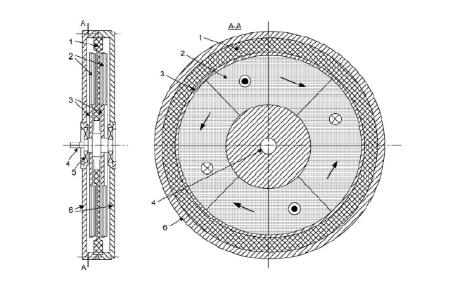
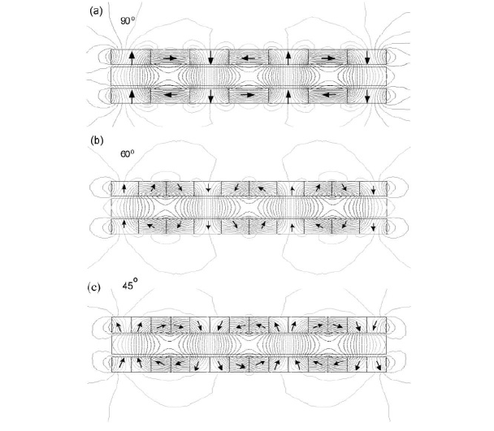

Halbach
=======

1.1.1.	Topoloji ve Yapısı

Herhangi bir ferromagnetik nüvesiz EASM fırçasız motor, Şekil 1.11’de gösterilmiştir. Motor, doğal sabit mıknatıslı (2) ikiz rotordan (3) ve magnetik olmayan destek yapısından oluşur. Çeliksiz stator (endüvi) sarımı (1) rotorun iki eş parçasının arasında yer alır. Çerçeveye (6) sabitlenen stator çokfaz sarımı, “taç yapraklar” gibi birleştirilmiştir. Çok turlu bobin, makinanın şaft ekseni etrafında üst üste binen tabakalar şeklinde düzenlenmiştir. Tüm sarım daha sonra, yüksek mekanik bütünleyici plastik veya reçineye gömülmüştür. Şekil 1.11’de gösterilen düzenleme herhangi bir yarıklı ferromagnetik nüve kullanmadığından motor, cogging(detent) torktan ve nüve kayıplarından arındırılmıştır. Sadece stator sarım iletkenlerinde ve nüvesiz stator sarımını destekleyen metal parçalardaki (eğer varsa) eddy akım kayıpları, kayıptır.

    : Şekil 1.11 Disk tipi nüvesiz sürekli mıknatıslı fırçasız makine: 1- nüvesiz stator sargısı, 2- SM, 3- çift rotor, 4- mil, 5- rulman, 6- çerçeve.

Yüksek güç (veya yüksek tork) yoğunluklu motor elde etmek için, hava boşluğundaki magnetik akı mümkün olduğunca yüksek olmalıdır. Bu, “Halbach dizisin”de yerleştirilmiş sabit mıknatısların kullanımı ile elde edilebilir. Pratikte, bitişik mıknatısların magnetizasyon vektörleri arasındaki açı 90o, 60o veya 45o'dir (Şekil 1.12).
 
Şekil 1.12 Çift rotor sabit mıknatıslarının 90o, 60o ve 45o Halbach dizisinde düzenlenmesi.

    : 1.1.2. Hava boşluğu magnetik akı yoğunluğu.

Halbach dizisinin yardımıyla, yüksek tepe değerli (0.6 T'nın üzerinde) magnetik akı yoğunluğunun dik bileşeni uyarılmışıtır. Bu değer yüksek elektromagnetik tork elde etmek için yeterlidir. Akı yoğunluğunun tepe değeri, EASM makinasının optimize edilmiş magnetik devresi için daha da yüksek olabilir. Pratikte 60o ve 45o Halbach dizisi benzer magnetik akı tepesi üretir. Magnetik akı yoğunluğunun dik bileşeninin tepe değeri, yüzey sabit mıknatıslarının standart yerleşiminkindekinden daha yüksektir. Çift taraflı PM yapısına büyük magnetik olmayan boşlukla eklenen destek ferromagnetik diskler, akı yoğunluğunu Halbach dizisi uyarması kadar arttırmazlar.
