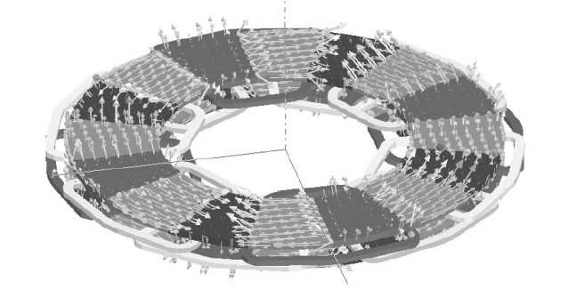

============
Introduction
============

The main characteristic feature of the axial flux permanent magnet machines is that the magnetic flux in the air gap is axially orientated. This feature has given the machine axial name. It is also referred to as disk machines in the literature. 

# The main characteristic of an AFPM machine is air gap flux path that is axially orientated. In addition, its modular structure allows it can be configured one air gap or more air gaps. Main usage of this type of machine is low speed and high torque applications. Another feature of it is designed without a magnetic core that name is coreless AFPM machine. Therefore, a coreless machine has zero cogging torque. Inductance of coreless winding can be very low compared the magnetic core machine [13]. #tezden

# The intended coreless AFPM generator should meet the requirements of LIL: high speed of projectile, small time constant of launcher current, high voltage and current i.e. high power. #tezden

# First design step is to obtain required frequency of stator current of generator. Increasing pole number is the basic method of raising frequency in electrical machines. Although it is possible in the AFPM machines, there is a limitation that is rotor diameter is greater when the number of poles is increased. The rotor diameter does not increase much because of the mechanical constraints. When the magnet size is made smaller, three phase stator windings cannot fit into the one pole. A novel wave winding configuration can overcome this problem. Pole number is increased with making smaller magnet size and contrary to conventional AFPM generator; one phase winding is placed between two rotors. Then, multistage design is carried out to obtain three phase machine. #tezden

# The AFPM generator has 40 poles and 4 rotors. Rectangular shaped NdFeB magnets are used. Two outer rotors have surface mounted and two inner rotors have buried magnets. Inner rotors are non-magnetic stainless steel because of minimizing the leakage flux. Due to the buried magnets, both side of the rotor have air gap. Therefore, induced voltage of the middle stator is lower than the outer stators. Increasing thickness of the magnets at the middle rotors is overcome this problem that is ignored in this work. #tezden

# Aydin et al. presented literature review of AFPM machines in detail. Advantages and disadvantages of various topologies were given. In this paper did not contain any mathematical background of represented works [Aydin et al., 2004].  #tezden

# Mahmoudi et al. presented another literature review of AFPM machines up to 2010. Topologies investigated in detail. Furthermore, subjects of field weakening, modeling and simulation, analysis, design procedures and applications were studied [Mahmoudi et al., 2011]. #tezden

# The AFPM machines differ from radial machines with air gap flux path that is axially orientated. Flexible configuration of the AFPM machine allows using it a variety of applications. One of the important features of the AFPM generator is the coreless structure. Lack of the iron core in the stator of the machine results in very low inductance of the stator windings compared to iron core machines \cite{2005wang_odoa:1381506}. Additionally, it comes through zero cogging torque. #2018 Coreless AFPM Pulsed Alternator With Low Internal Inductance

# Output power of the AFPM generator is related to the outer diameter of the machine. However, it cannot be increased easily because of the mechanical constraints. On the other hand, multistage design overcomes this problem \cite{2004profumo_afpm:1295962}. So, output power can be increased by the number of stage. #2018 Coreless AFPM Pulsed Alternator With Low Internal Inductance

.. rubric:: #başka bir yere yazmışım

# axial flux permanent magnet machines have been used increasingly using high-energy magnets for various applications. They have several unique features such as high efficiency, high power density, etc.. #başka bir yere yazmışım

# AFPM machines with coreless stators are regarded as high-efficiency machines for distributed power generation systems [27]. In these machines, the core losses of stators are eliminated. In addition, the ironless stator eliminates the direct magnetic attraction between rotors and stators [71].  #başka bir yere yazmışım

Stator 

we have two approaches to reduce the stator core losses: 

- reduce the flux density (B) in the stator teeth and yoke, and reduce the loss coefficient (K0) by using thinner, high quality cold-rolled silicon steel sheets (less than 0.3 mm). [6]
- Use coreless stator [7]

The main poim for the stator winding design of the high speed machine is high frequency stator current. The stator winding is exposed to high frequency current and high frequency magnetic field. TI1e skin effect should be considered. The wires of stator winding are divided into several individually insulated strands to reduce the skin effect. So use Litz wire (the wire was divided into individually insulated strands with small size) in spite of reduction the filling factor of the stator slots [13]

Rotor

3.1	Magnets
Eddy current losses in Nd-Fe-B are less than SmCo, also performance to cost of Nd-Fe-B is higher than SmCo.

.. rubric:: #başka bir yere yazmışım

History
-------

.. check

The axial flux machine is not a new discovery, the first working prototype was built by M. Faraday in 1831 [9]. But due to the complexity in mechanical design, difficulty to maintain a uniform airgap, and poor quality PMs, made the radial flux counterpart a more cost effective motor and has been the number one choice since its introduction in 1837 patented by inventor T. Davenport. After the invention of high quality PMs in the 1980s, the AFPM is now proven to be cost effective, and challenging its radial flux counterpart in a number of areas[3] :cite:`lomheim:2013`.

Axial vs Radial Flux Machines
-----------------------------

.. check

The difference between radial and axial flux machines lies in their names; the radial flux machine use radial directed magnetic flux established on the rotor which interacts with stator current to produce electromagnetic torque. The axial flux machine has axial directed magnetic flux which interacts with stator current to produce torque.
In an electrical machine the force is acting in the circumferential direction, which means that the current and magnetic fields are confined to the radial and axial directions which lead to the two machine types.
The advantage of the axial flux machine is the possibility to design a very compact disc shaped motor, with high torque per volume :cite:`lomheim:2013`.

.. math::
    
    T_{radial} = k D^2 L \\
    T_{axial} = k D^3

.. check

The machine torque sizing equations for a radial flux compared to axial flux is given by (2) and (3) respectively, where k is the machine constant used to compare sizing of equal designed machines, D is the diameter of rotor, and L is the length of the machine[2]. The key difference between axial flux and radial flux is that the radial flux machine can be scaled by adjusting the length of the machine, while the axial flux has an optimized machine length for a given diameter. The diameter of an axial flux machine has its mechanical limitations, where increasing the diameter results in higher torque while the contact surface to the shaft joint is constant[9]. Because of this, the scaling of an axial flux machine is done by having multiple discs when maximum diameter is reached. When the radial flux machine is scaled with length, the end coil volume remains the same, while an axial flux machine has the same amount of end coil in each inserted disc, giving the radial flux an advantage in high torque applications. It is proven that the axial flux design can be used in the high speed-high torque power ranges, and is up to four times lighter and much smaller than its radial counterpart at equal rating[7] :cite:`lomheim:2013`.

    : Axial vs Radial Flux Machines, The Design, Implementation, Evaluation and Results of a Race Car for the Collegiate Formula SAE Electric Competition 2016.

Axial Flux Machine Features
---------------------------

- For the analysis of axial-flux type motor, a three-dimensional finite element analysis (3-D FEA) approach was necessary. However, 3-D FEA requires large time for computation. [2006 Characteristic analysis of the slotless axial-flux type brushless DC motors using image method 188]

- Generally slotless single axial-flux type motors hardly saturated due to large and constant air-gap length so the analytical solutions can give precise result for this kind of application. [2006 Characteristic analysis of the slotless axial-flux type brushless DC motors using image method 188]

Topologies
----------

Sürekli mıknatıslı eksenel akılı makineler içinde birçok farklı topoloji bulunmakla birlikte, :numref:`afpm1` gibi sıradan bir tek rotor tek statorlu yapıda; sargılar, akının geri dönebileceği çelik bir plaka üzerine konumlanır ve sargıların üzerinde de rotora bağlı mıknatıslar bulunmaktadır. [4]

.. figure:: ../img/afpm1.png
    :align: center
    :scale: 100 %
    :name: afpm1

    : PM axial filed motor configuration

Nereden geldiği belli değil
---------------------------

AVANTAJLAR VE DEZAVANTAJLAR

Uygulamaya ve çalıştırma ortamına bağlı olarak, AFPM makinelerinin statörleri manyetik çekirdeğe sahip olabilir ya da tamamıyla çekirdeksiz(dolgusuz) olabilir. Çekirdeksiz statörlü AFPM makineleri, bir iç statöre ve ikili olan dış PM çarkına(veya kasnağına) sahiptirler(Fig 1.4d).  PM’ler, PM çarkına yardımcı çelik disklere veya manyetik olmayan destekleme yapılarına yapıştırılabilirler. İkinci husus olarak, PM’ler Halbach dizisine göre düzenlenir ve makine tamamıyla çekirdeksizdir. Çekirdeksiz ve fırçasız AFPM makinesinden sağlanan elektromanyetik tork, açık olan akım taşıyıcı iletken tarafından üretilir-PM etkileşimi (Lorentz Force Teoremi). Çekirdeksiz konfigürasyonlar demirsel manyetik materyalleri ortadan kaldırır, örneğin çelik tabakalar ve statörden kaynaklanan SMC tozları, sonuç olarak ortak anafor akımı ve histerez çekirdek kayıpları engellenir. Çekirdek kayıplarının yokluğundan dolayı, çekirdeksiz statörlü AFPM makinesi konvansiyonel makinelerden daha yüksek verimde çalıştırılabilir. Ancak, artırılmış manyetik olmayan hava boşluğuna bağlı olarak, bu tür makineler, demirsel manyetiğe sahip statör çekirdeğine sahip makinelere göre daha fazla PM materyali kullanır.
Çekirdeksiz statör sarmalı içinde tipik bobin şekilleri kullanılır(Fig 3.16, 3.17).

Bu bölümde, çekirdeksiz statörlü fırçasız AFPM makineleri ve konvansiyonel PM hareketleri ( çelik destek diske birleştirilmiş PM gibi) ele alınacaktır.

TİCARİ ÇEKİRDEKSİZ STATÖRLÜ AFPM MAKİNELERİ

Bodine Electric Şirketi, Chicago, IL, U.S.A. 178-mm (7- inch) and 356-mm (14-inch) çapa sahip e-TORQ™ ve çekirdeksiz statör sarımları olan ve çelik arka disklere sahip ikiz harici PM rotorlu AFPM motorlar üretir. Çekirdeksiz statör dizaynı, sözde çark torkunu elimine eder, düşük hız kontrolünü artırır, manyetik doyumsuzluğa bağlı doğrusal tork-akım karakteristiğini temin eder ve değerlendirilmiş torka göre on kata kadar yüksek tork sağlar. Motorlar, standart katı cisim konverterinden güç alsalar bile, aşırı düşük hızda çalışabilir. Buna ek olarak, belirli uygulamalarda, yüksek zirve tork kabiliyeti, yüksek maliyetli dişli kutularından ve yağ sızıntısı riskinden kaçınmayı sağlamaya izin verir.

356mm çaplı e-TORQ motorları, North Dakota State Üniversitesi öğrencileri tarafından, güneş arabasında direk itici güç (2003 American Solar Challenge (Fig. 5.1b)) olarak başarıyla kullanıldı. İyi dizayn edilmiş bir güneş aracı, maksimum miktarda güneş enerjisini, minimum miktarda dönme direnciyle mekanik enerjiye çevirebilmek için oldukça verimli ve hafif bir elektrik motoruna ihtiyaç duyar. Çekirdeksiz fırçasız AFPM motorları bu gereklilikleri sağlar.

Küçük demirsiz motorlar, yazılı akım statörü sarmalları ya da film bobin sarmallarına sahiptir. Film sarmal statör bobinleri birçok bobin katmanına sahiptir, ancak yazılı akım sarmalları bir veya iki bobin katmanına sahiptir. Fig 5.12, EmBest, Soeul, Güney Kore tarafından üretilen bir demirsiz fırçasız film sarmal statör bobini göstermektedir. Bu motor, statörün bir tarafında, tek taraflı PM eksitasyon sistemine ve diğer tarafında çelik destek sistemine sahiptir. Küçük film bobin motorları, bilgisayar çevresinde, bilgisayar hard diskinde, cep telefonlarında, çağrı cihazlarında, uçuş kayıt cihazlarında, kart okuyucularda, yazıcılarda, kopya makinelerinde, çizicilerde, mikrometrelerde, bandrol makinelerinde, video  kaydedicilerde ve sağlık ekipmanlarında kullanılır.

Bölüm 6

Stator ve Rotor Nüvesiz AFPM Makinaları

6.1 Avantajlar ve Dezavantajlar

Yüksek enerjili mıknatısların varlığı ile fırçasız AFPM makinalarının statorları ve rotorları ferromagnetik nüve kullanmaksızın üretilebilir [97, 138, 139, 203]. Süre gelen tasarımla karşılaştırıldığında makinanın tamamen nüvesiz tasarımı kütleyi azaltır ve verimliliği arttırır. Bunun yanında, nüvesiz AFPM fırçasız motor stator ve rotor arasında herhangi bir dik çekim kuvveti(!) oluşturmaz. Ayrıca sıfır akım durumunda tork darbelenmeleri(!) oluşturmaz.

Motor çapının arttırılmasıyla elde edilecek, ulaşılacak elektromagnetik torkun artışının bir sınırı vardır. Tek disk tasarımını sınırlayan etkenler bölüm 2.1.6’da listelenmiştir. Daha büyük torklar için makul çözüm çift veya üçlü disk motorlarıdır.

Stator ve rotor nüvesiz disk tipi PM fırçasız motorlar, ilk kez piyasa için 1990’ların sonunda, servo mekanizmaları ve endüstriyel elektromekanik sürücüler [138] için, güneşten güç alan elektrik araçları [203] için olduğu kadar bilgisayar bileşenleri için mikromotorlar ve cep telefonları için titreşim motorlarında [85] kullanılmak üzere üretilmişlerdir.

6.2 Yerleşim ve Yapı

Herhangi bir ferromagnetik nüvesiz AFPM fırçasız motor, Şekil 6.1’de gösterilmiştir. Motor, nadir toprak sabit mıknatıslı(!) (2) ikiz rotordan(3) ve magnetik olmayan destek yapısından oluşur. Çeliksiz stator (armatür) sarımı (1) rotorun iki eş parçasının arasında yer alır. Çerçeveye (6) sabitlenen stator çokfaz sarımı, “taç yapraklar” (Şekil 3.16) gibi birleştirilmiştir[139]. Çok turlu bobin, makinanın şaft ekseni etrafında üst üste binen tabakalar şeklinde düzenlenmiştir. Tüm sarım daha sonra, yüksek mekanik bütünleyici plastik veya reçineye gömülmüştür. Şekil 6.1’de gösterilen düzenleme herhangi bir yarıklı ferromagnetik nüve kullanmadığından motor, cogging(detent) torktan ve nüve kayıplarından arındırılmıştır. Sadece stator sarım iletkenlerinde ve nüvesiz stator sarımını destekleyen metal parçalardaki (eğer varsa) eddy akım kayıpları, kayıptır.

    : Disk tipi nüvesiz sabit mıknatıslı fırçasız makina: 1 - nüvesiz stator (armatür) sarımı, 2 - sabit mıknatıslar, 3 - çift(twin) rotor, 4 - şaft, 5 - rulman (bearing), 6 - çerçeve.

    : Disk tipi nüvesiz sabit mıknatıslı fırçasız makinanın modüler(segmental) yapısı: (a) tek modül (segment), (b) üç-modül montajı.

    : Sabit mıknatısları Halbach dizisinde düzenlenmiş üç fazlı 8 kutuplu AFPM fırçasız makinanın yapısı: (a) Sabit mıknatıs halkası; (b) stator sarımı; (c) çift(twin) rotorun bir yarısı; (d) stator sarımı ve tam çift(twin) rotor.

    : Halbach dizisinde düzenlenmiş sabit mıknatıslı 8 kutuplu çift(twin) rotor tarafından uyarılan 3B magnetik akı yoğunluğu dağılımı.

Modüler motor olarak tasarlanmış nüvesiz motor Şekil 6.2’de gösterilmiştir. Şaft gücü çıkışı istenilen seviyeye daha fazla modül eklenerek kolayca ayarlanabilir. 

    : Çift(twin) rotor sabit mıknatıslarının 90o, 60o ve 45o Halbach dizisinde düzenlenmesi.

Yüksek güç (veya yüksek tork) yoğunluklu motor elde etmek için, hava boşluğundaki magnetik akı mümkün olduğunca yüksek olmalıdır. Bu, “Halbach dizisin”de yerleştirilmiş sabit mıknatısların kullanımı ile elde edilebilir (Şekil 3.15, 6.3 ve Şkeil 6.4). Halbach dizisi tarafından uyarılmış magnetik akı yoğunluğu, denklem (3.42)'den (3.46)'ya kadar , tanımlanmıştır. Pratikte, bitişik mıknatısların magnetizasyon vektörleri arasındaki açı 90o, 60o veya 45o'dir (Şekil 6.5).

6.3 Hava boşluğu magnetik akı yoğunluğu

Şekil 6.6, nüvesiz AFPM fırçasız makinasının hava boşluğundaki magnetic alanın 'B FEM modellemesinin sonuçlarını gösterir. Kalıcı akı yoğunluğu Br= 1.2 T ve koersivitesi HC = 950 kA/m'lık NdFeB mıknatıslarıgöz önüne alınmıştır. Her bir sabit mıknatısın kalılığı 6mm, nüvesiz stator sarımının kalınlığı 10mm varsayılmış ve tek taraflı hava boşluğu kalınlığı 1 mm'ye eşittir.

    : Sabit mıknatısların Halbach dizisiyle uyarılmış çift taraflı nüvesiz AFPM fırçasız makinanın hava boşluğunun ortasındaki magnetik akı yoğunluğunun dik ve teğet bileşenleri: (a) 90o; (b) 45o.

Halbach dizisinin yardımıyla, yüksek tepe değerli (0.6 T'nın üzerinde) magnetik akı yoğunluğunun dik bileşeni uyarılmışıtır. Bu değer yüksek elektromagnetik tork elde etmek için yeterlidir. Akı yoğunluğunun tepe değeri, AFPM makinasının optimize edilmiş magnetik devresi için daha da yüksek olabilir. Pratikte 60o ve 45o Halbach dizisi benzer magnetik akı tepesi üretir (Şekil 3.22). Magnetik akı yoğunluğunun dik bileşeninin tepe değeri, yüzey sabit mıknatıslarının standart yerleşiminkindekinden daha yüksektir. Çift taraflı PM yapısına büyük magnetik olmayan boşlukla eklenen destek ferromagnetik diskler, akı yoğunluğunu Halbach dizisi uyarması kadar arttırmazlar.

6.4 Electromagnetik tork ve EMF

Halbach dizisi sabit mıknatıs uyarımlı nüvesiz AFPM fırçasız motorların elektromagnetik torku, (2.25), (2.26), (2.27), (2.120) ve (2.121) denklemleri temelinde hesaplanabilir. Benzer olarak, EMF, (2.29), (2.30), (2.118) ve (2.119) denklemlerine göre hesaplanabilir.

    : SEMA AFPM fırçasız makinanın açılmış görüntüsü. Lynx Motion Technology, Greenville, IN, ABD nezaketiyle.

6.	Ticari nüvesiz AFPM motorlar

Katmanlanmış elektro-magnetik dizi (SEMA) olarak bilinen nüvesiz AFPM Makine mimarisi, yüksek güç yoğunluğu ve yüksek verimlilik gerektiren elektrik motoru, aktüatör ve generatör uygulamaları için Lynx Motion Technology, Greenville, IN, ABD tarafından önerilmiştir [140]. Yüksek güç yoğunluğuna, yüksek verime ve düşük tork dalgacıklı elektromekanik sürücüye ihtiyaç duyan uygulamalar, hassas hareket kontrolü, su araçları itici sistemleri ve akustik olarak duyarlı uygulamaları içerir. SEMA teknolojisi, jant moto-generatör sistemleri gibi dağıtık üretim sistemleri ve enerji depolama sistemlerinde de uygulama alanı bulabilir. Yüksek torklu ve verimli motorlara, vitessiz elektromekanik sürücüler için gereksinimdir. Hız azaltıcısız doğrudan sürme motorların kullanımı vites sesini, yağ sızıntılarını, geri tepme ve bükülme sertliğinin azlığından kaynaklanan konumlandırma hatalarını ortadan kaldırır.

Stator nüvesiz ve dişsiz tasarım (Şekil 6.7) sadece cogging torku ortadan kaldırmaz bununla beraber iletkenler için mümkün olan alanı arttırır. Ayrıca tepe tork yeteneğini arttırır ve sabit mıknatısların daha verimli çalışmasına izin verir [140]. Stator bobinleri, yüksek direnimli ısıl iletken epoksi reçinesine batırılmıştır. Böyle bir yapı, makinaya yapısal bütünlük verir ve motor PWM ters beslemeliyken yüksek frekanslı titreşimi verimli olarak sönümler. Nüvesiz stator sarımlı makinalar, sabit hızda, değişken hızda ve ters dönmelerde mükemmel şekilde iş görür.

    : Teker içi motor, güneş araçları için nüvesiz AFPM fırçasız motorun PM halkası ve stator sarımı. CSIRO, Lindfield, NSW, Avustralya'nın nezaketi.

    : Film bobin nüvesiz stator sarımı ve çift(twin) sabit mıknatıslı rotorlu AFPM fırçasız motorun açılmış görüntüsü. EmBest, Seul, Güney Kore'nin nezaketi.

Tablo 6.1. 3 fazlı, 10-kW, 750-rpm demirsiz stator nüveli, disk tipi AFPM fırçasız makinanın tasarım veri ve parametreleri 

==================================================== =================
Tasarım verisi	
---------------------------------------------------- -----------------
Çıkış gücü Pout, W	                                 10000
Hız, n dds(rpm)	                                     750
Faz sayısı m1	                                     3 (Wye)
Giriş akımı I, A	                                 28.04
Giriş frekansı f, Hz	                             100
Stator(modül) sayısı	                             2
kutup çifti sayısı	                                 8
Bobin sayısı (3 faz)	                             24
Faz başına sarım sayısı	                             100 (tek modül)
Bobin sıklığı(!)	                                 1 slot
Tel çapı, mm	                                     6 x 1.2
PM'in eksenel kalınlığı hm, mm	                     6
Sarımın eksenel kalınlığı, tw, mm	                 10
Hava boşluğu (tek taraf) g, mm	                     1
Yük altında hava boşluğu magnetik akı yoğunluğu, T	 0.58
Akım yoğunluğu, A/mm^2	                             4.175
kd=Din/Dout ratio [5]	                             1/sqrt(3)
Rotor dış çapı Dout, mm	                             360
r=0.5Din, 'deki sarım paketleme faktörü	             0.65
Sarım sıcaklığı, oC	                                 75
Soğutma sistemi	                                     doğal
Yalıtım sınıfı	                                     F
==================================================== =================

AFPM fırçasız motorlar üretir [203]. Güneşten güç alan araçlar, her iki yılda bir Avustralya'da Darwin ve Adelaide arasında düzenlenen, iyi bilinen uluslararası etkinlik haline gelen World Solar Challange'da yarışır.

CSIRO, yüzey sabit mıknatısları çelik disklere yapıştırılmış ve sabit mıknatıslar Halbach dizisinde yerleştirilmiş tekerlek içi AFPM fırçasız motorların herbirini sağlar. Motor yapısı, sabit mıknatıs disk ve stator sarımı, şekil 6.8'de gösterilmiştir [203],

Şekil 6.9, EmBest, Seul, Güney Kore tarafından üretilen çift(twin) sabit mıknatıslı rotor ve film stator sarımlı nüvesiz fırçasız motoru gösterir. Nüvesiz stator her iki tarafında folyo sarıma sahiptir. 8 kutuplu sabit mıkantıslı rotor, çift(twin) harici rotor olarak tasarlanmıştır.  
