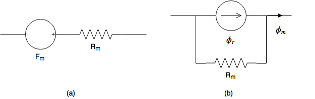

Magnetic Circuit Model
======================

Permanent Magnet Model
----------------------

Permanent magnet model consists of a reluctance (magnetic resistance) and a magneto motive force (mmf) :cite:`sadeghierad:2009detail`.

    : Permanent Magnet Model (a) Thevenin Equivalent Model, (b) Norton Equivalent Model.

Formulations for Thevenin Equivalent Model

.. math::

    R_m=\frac{l_m}{\mu_0\mu_{rm}A_m} \\
    F_m=\phi_rR_m \\
    \phi_r={B_rA}_m

Formulations for Norton Equivalent Model

.. math::

    \phi_m=B_mA_m=\left(B_r+\mu_0\mu_{rm}H_m\right)A_m \\
    \phi_m=\phi_r+\frac{F_m}{R_m}

