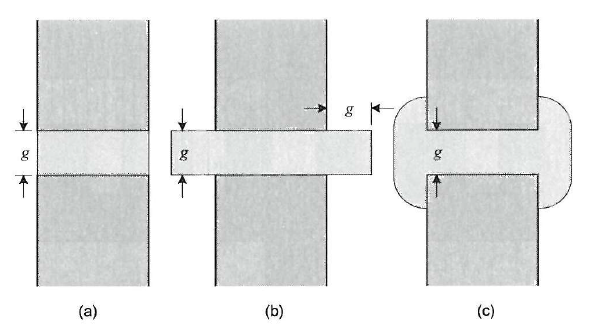

.. 1995 Design of slotless torus generators with reduced voltage regulation

Magnetic Circuit Model
======================

The analysis of systems with one or more closed magnetic flux path loops can be done with a magnetic circuit. An example of a magnetic circuit model of a two rotor and a coreless stator afpm machine is shown in :numref:`afpm-magnetic-circuit-model`.

.. figure:: ../img/afpm-magnetic-circuit-model.png
    :align: center
    :scale: 80 %
    :name: afpm-magnetic-circuit-model

    : Magnetic circuit model of a two rotor and a coreless stator afpm machine.

For accurate analysis with the magnetic circuit model, the model of each element should be obtained in detail. Sadeghierad et al. investigated magnetic circuit model elements of a high-speed AFPM generator :cite:`sadeghierad:2008leakage`, :cite:`sadeghierad:2009detail`. Zheng et al. investigated a one rotor one stator AFPM machine with using magnetic circuit model. Then a simplified model was obtained that ignores the back-iron reluctances :cite:`zheng:2005analysis`. 

Zheng:

Flux of permanent magnets and useful flux is calculated by

.. math::

    \phi_m=\phi_r\frac{P_g+4P_{ml}}{P_g+P_m+4P_{ml}} \\
    \phi_u=\phi_r\frac{P_g}{P_g+P_m+4P_{ml}}

Magnetic flux density of the air-gap, the stator back iron and the rotor back iron is given respectively.

.. math::

    B_g=\frac{\phi_u}{A_g}=\frac{B_rP_g}{P_g+P_m+4P_{ml}}\left(\frac{A_m}{A_g}\right) \\
    B_{si}=\frac{\phi_u}{{2A}_{si}}=\frac{B_rP_g}{P_g+P_m+4P_{ml}}\left(\frac{A_m}{{2A}_{si}}\right) \\
    B_{ri}=\frac{\phi_m}{{2A}_{ri}}=\frac{B_r\left(P_g+4P_{ml}\right)}{P_g+P_m+4P_{ml}}\left(\frac{A_m}{{2A}_{ri}}\right)

Burada manyetik direnç eşitlikleri şöyle verilmiştir [2]:

.. math::

    R_m=\frac{L_{axm}}{\mu_rA_m} \\
    R_g=\frac{L_g}{A_g}

Rotor ve stator arka çeliğinin manyetik dirençleri ihmal edilirse basitleştirilmiş model elde edilir. Böylece manyetik akı ve kullanılabilir akı şöyle olur [2]:

Buradan yola çıkarak tork ve elektromotor kuvvetin maksimum değeri şöyle bulunabilir [2][3]:

.. math::

    T=N_mk_dk_pB_gN_{tpp}i\left(R_o^2-R_i^2\right) \\
    e_{max}=N_mk_dk_pB_gN_{tpp}\left(R_o^2-R_i^2\right)\omega_m

Burada;

:math:`N_m`	kutup sayısı

:math:`k_d`	sargı dağılım katsayısı

:math:`k_p`	sargı adım katsayısı

:math:`N_{tpp}`	kutup başına, faz başına tur sayısı

:math:`\omega_m`	rotor açısal hızı

:math:`R`	yarıçap

Permanent Magnet Model
----------------------

Permanent magnet model consists of a reluctance (magnetic resistance) and a magneto motive force (mmf) :cite:`sadeghierad:2009detail`.

.. figure:: ../img/pm-magnetic-circuit-model.png
    :align: center
    :scale: 100 %
    :name: pm-magnetic-circuit-model

    : Permanent Magnet Model (a) Thevenin Equivalent Model, (b) Norton Equivalent Model.

Formulations for Thevenin Equivalent Model

.. math::

    \begin{align}
        R_m &= \frac{l_m}{\mu_0\mu_{rm}A_m} \\
        F_m &= \phi_rR_m \\
        \phi_r &= {B_rA}_m
    \end{align}

Formulations for Norton Equivalent Model

.. math::

    \begin{align}
        \phi_m &= B_m A_m \\
        &= B_r A_m+\mu_0\mu_{rm}H_m A_m \\
        &=\phi_r+\frac{F_m}{R_m}
    \end{align}

Leakage Flux Model
------------------

In general, leakage flux is existed two different fashion in permanent magnet machines. Self-leakage flux is existed between permanent magnet and back iron. The other one is seen between two adjacent permanent magnets. In :numref:`pm-leakage-flux-model`, 1a and 1b are self-leakage flux paths of magnet and 2 is the leakage flux path between two magnets.

.. figure:: ../img/pm-leakage-flux-model.png
    :align: center
    :scale: 100 %
    :name: pm-leakage-flux-model

    : PM Flux Leakage Model.

Self-leakage flux and leakage flux between two PMs are shown :math:`R_{L1}` and :math:`R_{L2}` respectively in magnetic circuit model.

.. figure:: ../img/pm-leakage-flux-circuit-model.png
    :align: center
    :scale: 100 %
    :name: pm-leakage-flux-circuit-model

    : PM Flux Leakage Circuit Model.

Self-leakage flux equations:

.. math::

    R_{L1}=R_B||R_C \\
    R_B=\frac{2(P/2)}{\mu_0\delta\left(\left(D_i-L_{PM}\right)Ln\frac{L_{PM}+2g}{L_{PM}}+2g\right)} \\
    R_C=\frac{9(P/2)}{\mu_0\delta\left(\left({3D}_o+{2L}_{PM}\right)Ln\frac{L_{PM}+3g}{L_{PM}}-6g\right)}

Aynı kişilerin diğer bildirisinde eşitlikler şu şekildedir:

.. math::

    R_{L1}=\frac{1}{P_B+P_C} \\
    P_B=\frac{2(P/2)}{\delta\left(\left(D_i-L_{PM}\right)Ln\frac{L_{PM}+2g}{L_{PM}}+2g\right)} \\
    P_C=\frac{9(P/2)}{\delta\left(\left({3D}_o+{2L}_{PM}\right)Ln\frac{L_{PM}+3g}{L_{PM}}-6g\right)}

İki mıknatıs arasındaki kaçak akı ise şu şekildedir:

.. math::

    R_{L2}=\frac{1}{\mu_0{Per}_2} \\
    {Per}_2\left(permeance\right)=\frac{L_{PM}\times P}{2\pi(1-\delta)}Ln\frac{R_o}{R_i}

Leakage flux between two magnets:

.. math::

    R_{L2}=\frac{2\pi(1-\delta)}{\mu_0l_mp\ln{\left(\sfrac{R_o}{R_i}\right)}}

    : PM Flux Leakage Between magnets.

Rotor Back-Iron Model
---------------------

Makinenin önemli bir parçası çeliğidir. Dışta iki rotorlu eksenel akılı makinelerde, makinenin sonlarında çelikler bulunmaktadır. Arka çeliği modellemek için bir FEM yazılımında kullanılan B(H) formülü şöyle tanımlanmıştır [1][4].

.. math::

    B\left(H\right)=\mu_0H+\frac{2J_S}{\pi}\arctan{\left(\frac{\pi(\mu_r-1)\mu_0H}{2J_S}\right)}

Most of the permanent magnet machines, ferromagnetic material, commonly iron or steel, is located back of the magnets in order to complete the flux path. A FEM based software was described the formulation for modeling the back iron [Sadeghierad, M., et al., 2008]:

.. math::

    B_i\left(H_i\right)=\mu_0H_i+\frac{2J_S}{\pi}\arctan{\left(\frac{\pi\left(\mu_{ri}-1\right)\mu_0H_i}{2J_S}\right)}

Coefficient J_S is determined from B-H graphics below:

J_S katsayısı aşağıdaki şekilde gösterilmiştir:

    : Back-Iron Model.

Böylece arka çeliğin modeli doğrusal olmayan bir manyetik dirençtir (Riron) [142].
Çeliğin manyetik direncini hesaplamak için çeliğin manyetik geçirgenliği kullanılır. Çeliğin manyetik geçirgenliği başlangıçta iteratif olarak çeliğin akı yoğunluğu (1) denklemini ve BH eğrisini sağlayacak şekilde hesaplanır [12].

Therefore, model of back iron is a nonlinear magnetic reluctance (R_{iron}) [Sadeghierad, M., et al., 2009].

The permeability of back iron is used to calculate the reluctance of the back iron. 

.. math::

    R_{iron}=\frac{F_i}{\phi_i}=\frac{H_il_i}{B_rA_i}

Lombard et al., presented another method for calculating the back iron model. In this method the iron permeability is used to calculate the reluctance of iron with equation (8) that peak air gap flux density of two rotor, one stator machine. Iteratively calculating the core iron flux density that satisfies both (8) and the iron’s BH curve until the result converges sufficiently [Lombard and Kamper, 1999].

.. math::

    B_{agp}=\left(\frac{4R_m}{4R_m+4R_{ag}+R_{iron}}\right)B_r

Fringing Effect Model
---------------------

Saçak etkisini modellemek için her bir saçak yolunun manyetik iletkenliğini kullanılır. 4 tane geçiş vardır ve böylelikle dört manyetik iletkenlik ve manyetik direnç bulunmaktadır [144, 142]. Hava aralığının eşdeğer manyetik direnci Rg1 ile tüm bu dirençlerin paralelidir [144].

.. math::

    R_g=R_{g1}||\left(R_1||R_2||R_3||R_4\right)

Kaçak etkisinin her bir yüzey için etkisi şu eşitlik ile elde edilebilir [144, 142]:

.. math::

    P_i\left(permeance\right)=\frac{W}{\pi}Ln\left(1+2\sqrt{\frac{x+x^2+xg}{g}}\right)

Burada W: mıknatıs kalınlığı, x: saçağın başlangıç noktası ve g: hava aralığı olarak adlandırılmıştır [144]. Manyetik direnç ise şu eşitlikten elde edilebilir [142]:

.. math::

    R_i=\frac{1}{\mu_0\mu_{rPM}P_i}

    : Fringing Effect Model.

Air Gap Model
-------------

Nüvesiz statorun her iki tarafında hava aralığı bulunmaktadır ve Rg1 ile modellenebilir:

.. math::

    R_{g1}=\frac{\left(L_g+2g\right)}{\mu_0A_g} \\
    A_g=\pi\left(\left(\frac{D_o}{2}\right)^2-\left(\frac{D_i}{2}\right)^2\right)\times\frac{1}{P}

There are number of techniques for modeling flux flow in an air-gap as depicted in Fig. The simplest model (Fig) ignores the fringing effect and model is exactly surface area of magnets. An improvement of this model which is accurate when g/A is small. The length g is added to the perimeter of surface area to obtain new surface area. Last refinement model the fringing flux as a separate permeance in parallel with the permeance of the direct flux path across the air-gap [Hanselman, 2003].

    : Air gap model.

In this figure, the fringing flux is assumed to follow a circular arc from the side of one block, travel in a straight line across the gap area, then follow a circular arc to the other block. The calculation of the air gap permeance using this circular-arc, straight-line approximation utilizes the fact that permeances add in parallel just as electrical conductances do. The air gap permeance Pg in Fig. 2.9 is equal to the sum of P_s and 4P_f (one P_f for each side of the block) [Hanselman, 2003].
 
.. figure:: ../img/air-gap-model-2.png
    :align: center
    :scale: 100 %
    :name: air-gap-model-2

    : Air gap model in detail.

.. math::

    P_f=\int_{0}^{X}{\frac{\mu_0L}{g+\pi x}dx}=\frac{\mu_0L}{\pi}\ln{\left(1+\frac{\pi X}{g}\right)}

Magnetic Model of Zheng
-----------------------

