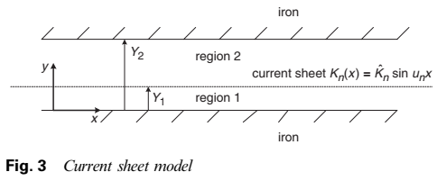
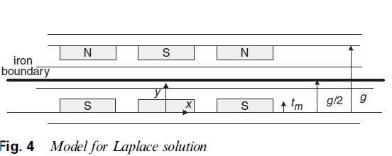

========================
Magnetic Field In Airgap
========================

In principle, torque is generated by the interaction of the coil current with the field of the magnet. In order to calculate the torque, it is necessary to know the magnetic field solution and position of the magnet (with its region), and winding structure. Due to the three-dimensional structure of the AFPM machines, it is difficult to obtain the field solution in a closed form. Instead, numerical methods such as a two-dimensional approach or a finite element method can be used. However, techniques such as finite element method make it impossible to make parametric analysis related to existing design :cite:`bumby:2005`.

In principle, torque is generated by the interaction of the coil current with the field of the magnet. In order to calculate the torque, it is necessary to know the magnetic field solution and position of the magnet (with its region), and winding structure. Due to the three-dimensional structure of the AFPM machines, it is difficult to obtain the field solution in a closed form. Instead, numerical methods such as a two-dimensional approach or a finite element method can be used. However, techniques such as finite element method make it impossible to make parametric analysis related to existing design [8]. #tezden

Campbell presented investigation of a axial field permanent magnet machine with one rotor and one stator. Potential distribution (\psi) in the air gap was given with solving Laplace Equation. In order to find flux distribution in the air gap, potential distribution over the pole surface had to be known. Magnetizing force (H) integral was given and was calculated numerically. In addition, expression for EMF was analytically calculated. By defining a "moment of flux density" EMF was not dependent an angular position. Also proof of \sfrac{R_o}{R_i}=\sqrt3  was given with calculation of armature power. Flux density versus distance from magnet graph related to pole arc/pole pitch ratio was given. Flux density at flux return ring compared with calculated value. He noted that there is a need to optimize the pole arc/pole pitch ratio [Campbell, 1974]. #tezden

# Campbell presented investigation of a axial field permanent magnet machine with one rotor and one stator. Potential distribution (\psi) in the air gap was given with solving Laplace Equation. In order to find flux distribution in the air gap, potential distribution over the pole surface had to be known. Magnetizing force (H) integral was given and was calculated numerically. In addition, expression for EMF was analytically calculated. By defining a "moment of flux density" EMF was not dependent an angular position. Also proof of \sfrac{R_o}{R_i}=\sqrt3  was given with calculation of armature power. Flux density versus distance from magnet graph related to pole arc/pole pitch ratio was given. Flux density at flux return ring compared with calculated value. He noted that there is a need to optimize the pole arc/pole pitch ratio [Campbell, 1974]. #reviewden

Magnetic Potential
------------------

The magnetic potential can be used for two quantites in classical electromagnetic: the *magnetic vector potential*, :math:`A`, (often called the vector potential) and the *magnetic scalar potential*, :math:`\psi`. Both quantites are used to calculate the magnetic field in certain situations.

**The magnetic vector potential**, :math:`A`, is the most frequently used form :math:`B = \nabla \times A`. The magnetic vector potential along with the electric potential, :math:`\varphi`, can be used to identify the electric field, :math:`E`. Therefore, many equations of electromagnetic can be written with both :math:`E` and :math:`B` terms and magnetic vector potential, :math:`A`, and electric potential, :math:`\varphi`.

**The magnetic scalar potential**, :math:`\psi`, is sometimes used to determine where the magnetic field, :math:`H`, is not any free currents. Similarly, the electric potential is used to determine the electric field in the electrostatic. A major use of magnetic scalar potential is to determine the magnetic field due to permanent magnet if magnetization is known :cite:`wiki:magnetic`.

# The magnetic potential can be used for two quantites in classical electromagnetic: the magnetic vector potential, A, (often called the vector potential) and the magnetic scalar potential, \psi. Both quantites are used to calculate the magnetic field in certain situations. #tezden

# The magnetic vector potential, A, is the most frequently used form B=\mathrm{\nabla}\times A. The magnetic vector potential along with the electric potential, \varphi, can be used to identify the electric field, E. Therefore, many equations of electromagnetic can be written with both E and B terms and magnetic vector potential, A, and electric potential, \varphi. #tezden

# The magnetic scalar potential, \psi, is sometimes used to determine where the magnetic field, H, is not any free currents. Similarly, the electric potential is used to determine the electric field in the electrostatic. A major use of magnetic scalar potential is to determine the magnetic field due to permanent magnet if magnetization is known [9].  #tezden

Solution with Magnetic Scalar Potential
---------------------------------------

A. Sommerfeld in 1952 showed the potential expression at a distance of :math:`r` from a magnet :cite:`sommerfeld:1952`: 

.. math::

    4\pi\psi=\int\frac{div\vec{M}}{r}dv+\int\frac{M_s}{r}dA

Based on this equation P. Campbell obtained field expressions and calculated numerically in 1974 and 1975.

Campbell showed the equations of potential distributions (magnet and air gap) in 1974. It also achieved the gradient of the equation above to reach the expression of the magnetization force :cite:`campbell:1974`.

.. math::

    H_x=\frac{M_sx}{4\pi}\int_{-\beta}^{\alpha-\beta}{\left[\frac{r.s.\cos{\theta}-x^2-s^2}{{\left(x^2+s^2.\sin^2{\theta}\right)\left(x^2+r^2+s^2-2.r.s.\cos{\theta}\right)}^{1/2}}\right]_{r=R_1}^{R_2}d\theta}

In 1975, Campbell stated that in order to optimize the design and performance of the machine, the space distribution in the air gap must be known precisely. In this direction, the area in the air gap; calculated from the potential distribution of magnet poles on the surface. By assuming the magnetization as constant, the integral of the potential distribution and calculating this integral numerically :cite:`campbell:1975`.

.. math::

    \psi=\frac{M_s}{4\pi}\int_{-\beta}^{\alpha-\beta}{\left[\left(x^2+r^2+s^2-2.r.s.\cos{\theta}\right)^{1/2}+s.\cos{\theta}.\sinh^{-1}{\frac{r-s.\cos{\theta}}{\left(x^2+s^2.\sin^2{\theta}\right)^{1/2}}}\right]_{r=R_1}^{R_2}d\theta}

The field in the air gap is found by solving the Laplace equation from the boundary potential distribution and taking the required gradient :cite:`campbell:1975`.

A practical method has been introduced by E.P. Furlani in order to make rapid parametric study on the field strength of the AFPM motor in 1992. In this method, the analytical expression of the field expression in the air gap is first shown. In this analysis, a large number of magnets with two-dimensional model geometry and these magnets are thought to be thin and continuous. This article also describes the determination of the mean magnetization value by a quasi-experimental method :cite:`furlani:1992`.

.. math::

    \Phi_{gap}\left(x,y\right)=-\frac{4}{M}\sum_{n=1,3,5\ldots}^{\infty}{\frac{{(-1)}^{(n-1)/2}}{\left(n\pi\right)^2K(n,h,g,l)}\bullet\sinh{\left(\frac{n\pi y}{l}\right)}\cos{\left(\frac{n\pi x}{l}\right)}} \\
    B_{gap,y}\left(x,y\right)=-4\mu_0M\sum_{n=1,3,5\ldots}^{\infty}{\frac{{(-1)}^{(n-1)/2}}{n\pi K(n,h,g,l)}\bullet\cosh{\left(\frac{n\pi y}{l}\right)}\cos{\left(\frac{n\pi x}{l}\right)}} \\
    K\left(n,h,g,l\right)=\cosh{\left(\frac{n\pi g}{l}\right)}-\sinh{\left(\frac{n\pi g}{l}\right)}\bullet\coth{\left(\frac{n\pi}{l}(g-h)\right)}

Again in the same year J.K. Lee made measurements on three different machines based on the equation of Furlani :cite:`lee:1992`.

Furlani expanded his work in 1994 and introduced a more realistic approach. Compare the results with the Maxwell software that using the finite element method :cite:`furlani:1994`.

.. math::

    \Phi_{gap}\left(x,y\right)=\frac{4l\mu_0M_s}{\mu}\sum_{n=1,3,5\ldots}^{\infty}{\frac{{(-1)}^{(n-1)/2}}{\left(n\pi\right)^2K(n,h,g,l,\mu)}\bullet\sinh{\left(\frac{n\pi y}{l}\right)}\cos{\left(\frac{n\pi x}{l}\right)}} \\
    B_{gap,y}\left(x,y\right)=\frac{4\mu_0^2M_s}{\mu}\sum_{n=1,3,5\ldots}^{\infty}{\frac{{(-1)}^{(n-1)/2}}{n\pi K(n,h,g,l,\mu)}\bullet\cosh{\left(\frac{n\pi y}{l}\right)}\cos{\left(\frac{n\pi x}{l}\right)}} \\
    K\left(n,h,g,l,\mu\right)=-\frac{\mu_0}{\mu}\cosh{\left(\frac{n\pi g}{l}\right)}+\sinh{\left(\frac{n\pi g}{l}\right)}\bullet\coth{\left(\frac{n\pi}{l}(g-h)\right)}

.. rubric:: Acquiring Magnetization of Magnet

In order to reach an approximate M value in a magnet, the magnet sample is cut by EDM (electric discharge machining) and after magnetization is magnetized, the corrosion is examined by ultrasonic methods, then the magnetic flux density is measured in the middle of the cylinder. In a cylindrical example, the magnetic flux density can be calculated by the following formula:

.. math::

    B_z=\frac{\mu_0M}{2}\left[\frac{z+L}{\sqrt{\left(z+L\right)^2+a^2}}-\frac{z}{\sqrt{z^2+a^2}}\right]

Solution with Magnetic Vector Potential
---------------------------------------

Furlani revealed semi-analytical three-dimensional expression of magnetic flux density in 1994. The vector potential was used and the numerical integral of the Green function was taken in empty space over a single variable. Field components are expressed as finite sums of fundamental functions :cite:`furlani:1994three`. Then he applied this equation to a motor and tested it with finite element method in 1997 :cite:`furlani:1997three`.

J.R. Bumby et al. obtained the expressions of the magnetic field in the air gap of the cored AFPM by using the current surface technique and vector potential distribution in 2004 :cite:`bumby:2004`. By using this method in 2005, they have reached the equations of the magnetic field in the air gap for the coreless AFPM machine :cite:`bumby:2005`. A similar technique was used in :cite:`smith:1999` and  :cite:`wallace:2001` publications.

    : Current Sheet Model :cite:`bumby:2004`

Firstly, the problem was solved by reducing the machine to two-dimensional geometry as shown in :numref:`afpm-current-sheet-model`. It is then divided into layers for different environments (steel, air, etc.). The boundary between each layer is named current sheet. 

Vector potential and magnetic field were obtained by solving Laplace equation (:math:`\nabla^2\vec{A}=0`). The solution of the Laplace equation gives the vector potential and the normal component of the magnetic field. Since the magnetic vector potential is only the z component, the magnetic field expressions are as follows :cite:`bumby:2004`:

The problem is symmetrical on both sides of the centerline and the iron limit can be selected along the centerline to convert to a one-sided problem as shown in :numref:`afpm-model-for-laplace-solution` :cite:`bumby:2005`. 

.. math::

    H_x=\frac{1}{\mu_0}\frac{\partial A}{\partial y} \\
    H_y=-\frac{1}{\mu_0}\frac{\partial A}{\partial x}

It then obtained the current density distribution to obtain the final equations for the air gap :cite:`bumby:2005`. 

.. math::

    A_{zn}\left(x\right)=-\frac{\vec{J_n}\mu_0}{u_n^2}\frac{\sinh{u_nt_m}}{\sinh{u_n\frac{g}{2}}}\cosh{u_n\left(\frac{g}{2}-y\right)}\sin{u_nx} \\
    B_{yn}\left(x\right)=\frac{\vec{J_n}\mu_0}{u_n}\frac{\sinh{u_nt_m}}{\sinh{u_n\frac{g}{2}}}\cosh{u_n\left(\frac{g}{2}-y\right)}\cos{u_nx}

Here;

.. math::

    u_n=\frac{\pi n}{\tau} \\
    \vec{J_n}=\frac{4}{\tau}\frac{B_{rem}}{\mu_0\mu_{rec}}\sin{\frac{u_n}{2}}d_m

    : afpm-model-for-laplace-solution

In 2008, G.F. Price et al. designed a wind generator based on Bumby's analytical calculations :cite:`price:2008`.

.. rubric:: Scalar

==== =====================================================================================================================
Year Paper Name
---- ---------------------------------------------------------------------------------------------------------------------
1974 Principles of a permanent-magnet axial-field d.c. machine #campbell
1975 The magnetic circuit of an axial field DC electrical machine #campbell
1992 A Method Predicting the Field in Permanent Magnet Axial-Field Motors #furlani
1992 Measurement of Magnetic Fields in Axial Field Motors #lee
1994 Computing the field in permanent-magnet axial-field motors #furlani
2007 Computation of No-load and Armature Reaction Fields of an Axial-Flux Permanent-Magnet Synchronous Generator #chan xie
==== =====================================================================================================================

.. rubric:: Vector

==== =====================================================================================================================
Year Paper Name
---- ---------------------------------------------------------------------------------------------------------------------
1994 A three-dimensional field solution for axially-polarized multipole disks #furlani
1997 A three-dimensional field solution for permanent-magnet axial-field motors #furlani #knewston
1997 Field analysis and optimization of NdFeB axial field permanent magnet motors #furlani
==== =====================================================================================================================
