Others
======

Alan Zayıflatma
---------------

Sürekli mıknatıslı makinelerde, sürücünün azami hızını, gelişimini ve uygulamasını sınırlayan sabit bir manyetik tahrik bulunur. Geleneksel yaklaşımda, sürücüler, bu problemden kurtulmak için alanı zayıflatırlar; bunun için temel hıza kadar frekans başına sabit gerilim ile, temel hızın üzerinde ise sabit gerilim ile kontrol edilmektedir. Yüksek hızlarda hava aralığı akısını azaltmak için vektör kontrol teknikleri kullanılmaktadır ve d-ekseni akımının negatif bileşeni stator sargılarına uygulanır. Eğer büyük bir akımın negatif d-ekseni bileşeni sargılara uygulanırsa, mıknatıslar geri dönmeyen demanyetizasyon bölgesinde çalışabilir ve akım kesildiğinde mıknatıslar eski çalışma noktasına dönmeyebilir. Ek olarak bu yöntemde stator sargıları üzerindeki bakır kayıpları artacaktır.  Böylece bu yaklaşımda tork ve verimlilik düşecektir. [62] 

Alan zayıflatma veya mıknatıslı makinelerde d-ekseni akımının etkilerini yok etmek için sargılara negatif bileşen uygulama kontrolü literatürde büyük ilgi görmüştür. [62]
Hava aralığı akısı kontrolü birçok avantaj sağlamaktadır: basit akı kontrolü, mıknatıslarda demanyetizasyon riskini yok etmek, üreteç çalışmasında gerilim kontrolü ve sabit güçte çalışma bölgesine genişletme sağlanabilmektedir. [62]

Core Losses
-----------

Eğer stator nüve malzemesi ve akı yoğunluğu; 60.000 d/d olan bir makineyle 3.000 d/d olan bir makineyle aynı olduğunda kilogram başına nüve kayıpları yaklaşık 50 kat olmaktadır. Bu sebeple nüvesiz stator tercih edilmiştir [142, 27, 70, 12].

Winding
-------

Yüksek frekanslı akım ve manyetik alandan dolayı stator sargılarında yüzey etkisi (skin effect) görülecektir. Bu sebeple sargı telleri birbirinden bağımsız tellere bölünerek kullanılabilir ve yüzey etkisi azaltılabilir [142]. Diğer bir alternatif de litz telidir. Burada çok ince yalıtılmış tellerden istenilen çapta tel elde edilebilmektedir. 

Sargı tasarımında belirlenmesi gereken önemli parametrelerden biri tel çapıdır. Tasarım yapılırken akım yoğunluğunun yaklaşık 7A/mm2 alınması iyi sonuç verecektir [61].

Stator Core
-----------

Bu yapıda statorun geometrisi oldukça önemlidir. Özellikle oluklu yapıda oluklar ve çıkıntılar önem kazanmaktadır. Eddy akımlarından ötürü nüvede saf çelik kullanılamaz. Eğer lamine çelik kullanılacaksa, laminasyon spiral şekilde sarılarak elde edilir. Öncesinde veya spiral formun sonrasında olukları açmak oldukça zordur [6]. Bu noktada yumuşak manyetik kompozit (SMC) malzemeler öne çıkmaktadır.

Vuruntu Momenti Azaltma
-----------------------

Vuruntu momentini azaltmak için birçok yöntem uygulanmaktadır. Bunlardan en önemlileri; mıknatıslara eğim verme, oluklara manyetik kama yerleştirme, mıknatıs genişliğini ayarlama ve mıknatıs aralığı azaltmaktır. Ayrıca iki rotorlu yapı için rotorlar arası kayma yapılmasıdır. Bu yöntemler iki rotorlu bir makine için 2004 yılında Carrichi F. v.d. tarafından incelenmiştir [65].

1.1.1	Mıknatıs Eğimi

Birçok vuruntu momentini azaltma yöntemi içinde, mıknatıslara eğim verme, literatürde en çok kullanılan yöntemdir. Mıknatısların eğim açısı artırıldığında EMK'in rms değeri düşmektedir. Diğer bir taraftan vuruntu momenti ise beklendiği gibi azalmaktadır [65]. Yapılan bir çalışmada 19 derece eğim verildiğinde minimum vuruntu momentine erişildiği ve eğim olmadığında olan vuruntu momentinden %80 daha az bir değere ulaştığı belirtilmiştir [65]. Bu çalışmaya ait EMK rms değeri ve vuruntu momenti - eğim grafiği Şekil 4.2'de görülmektedir [65]. Ek olarak mıknatıslara eğim verildiğinde harmoniklerin de azaldığı belirtilmiştir. 
 
Şekil 4.2 Mıknatıs eğim açısı vuruntu momenti ve EMK rms değeri grafiği

1.1.2	Manyetik Kama

Oluklu yapıdaki EASM makinelerde manyetik kama kullanılmasındaki temel amaç, artırılmış bir d ekseni indüktansı sağlamaktır (indüktans veya üç katına çıkabilmektedir). Böylelikle akı zayıflama durumu altındaki makine çalışması oldukça iyileştirilmektedir [65]. Yapılan çalışmada Somaloy kamalar kullanılarak vuruntu momenti, klasik PVC kamalara göre %40 azaltılmıştır [65].  

1.1.3	Mıknatıs Aralığı Azaltma

Birçok SM makinede ve EASM makinelerde 2p tane kutup genellikle eşit aralıklarla dizilir. Ancak daha önce incelenen [r1] makalesinde uygun bir mıknatıs genişliği için farklı bir mıknatıs aralığı uygulanarak vuruntu momentindeki harmonik bileşenler tamamen yok edilmiştir. Buna göre 2π/2p şeklindeki düzenli mıknatıs aralığı 2π/pz şeklinde azaltılmalıdır ve p kutuptan sonraki mıknatıs tam bir oluk aralığı kadar diğer tarafa kaydırılır. Böylelikle iki set aralığı azaltılmış mıknatıs grubu ortaya çıkar. Bu tekniğin sonucunda p'nin (kutup sayısının yarısı) tam sayı katlarındaki harmonikler hariç, ilk ve bütün yüksek harmonikler vuruntu momenti dalgasından elenir. Sonuç olarak oldukça yumuşak bir rotor hareketi meydana gelir [65].

1.1.4	Mıknatıs Genişliği

Minimum vuruntu momentini belirlemek üzere; mıknatıs genişliğinin oluk adım aralığına oranının önemli bir etken olduğu geleneksel radyal akılı makineler için literatürde belirtilmiştir [65]. Eksenel akılı makinelerde ise oluklar sabit genişlikli olduğu için çap arttıkça oluk adım aralığı da değişmektedir. Mıknatıs genişliğinin etkisini tam olarak görebilmek için mıknatısları trapezoidal olarak seçmek daha uygun olacaktır. Yapılan çalışmada farklı genişlikte dikdörtgen mıknatıslar kullanılmış, burda mıknatıs genişliği ile vuruntu momentinin değiştiği gözlenmiştir [65]. 
Özetle tasarlanan makinenin geometrisiyle alakalı olarak farklı mıknatıs genişlikleri ile minimum vuruntu momenti belirlenebilmektedir.

1.1.5	Rotorlarda Açısal Kaydırma

Rotorlarda açısal olarak bir kayma uygulandığı zaman vuruntu momenti önemli ölçüde azalmaktadır. Ek olarak bu kaymadan dolayı EMK'in dalga formu da değişecektir. Yapılan çalışmada üçüncü ve beşinci harmonikler önemli ölçüde azalırken EMK'in rms değeri de azalmıştır [65].

Elektrikli Araçlar
------------------

Elektrikli araçlarda düşük hızlı bir motor, direk tekere bağlanırsa, aracın ağırlığında azalma ve sürüş verimliliğinde artış sağlar [3].

Kayıplar
--------

Sürekli mıknatıslı makinelerde temelde; statorda histerisis ve eddy akımları, rotor mıknatıslarında ve sargı iletkenlerinde de eddy akımları kayıpları mevcuttur [65].

Kayıp hesapları için 142 ve 144 incelenmelidir.

1.1	Nüve Kayıpları

Nüveli yapıdaki nüve kayıplarının büyük bir kısmı statordadır. Bu nedenle stator yapısı lamine olmak zorundadır. Buna karşın rotor çeliği sadece mıknatısın D.A. akısını taşır, bu sebeple rotor çeliği (nüvesi) tek parça ferromanyetik malzeme olabilir [120]. 

1.2	Bakır Kayıpları

1.3	Eddy Kayıpları

Eddy akımı kayıpları manyetik alanın karesi ve frekansın karesi ile doğru orantılı, rotor malzemesinin direnci ile ters orantılıdır [9].

Oluklu yapıda bir vuruntu ve titreşim momenti oluşmaktadır. Bazen bunu ortadan kaldırmak için oluksuz yapı tercih edilmektedir. Ancak bu geometri sargılardaki eddy kayıplarını artırmaktadır [120].

Mıknatıs Kalınlığı
------------------

Eksenel akılı makinelerde akıyı makinenin katmanlarından bağımsız kılmak için her bir hava aralığının karşısındaki mıknatıs gerekli mmk'yı hava aralığı boyunca düşürmelidir. Hava aralığının manyetik direncine bakıldığında, nüvenin manyetik direnci çok daha yüksektir (μr=5000). Böylelikle bütün mmk'nın hava aralığında olduğu söylenebilir. Dolayısıyla, hava aralığı mesafesine bağlı bir mıknatıs kalınlığı eşitliği gereklidir [61]:

.. math::

    l_m\approx\frac{A_mB_ml_g}{\mu_0A_pH_m}

Burada;

- lm	mıknatıs kalınlığı [m]
- lg	hava aralığı mesafesi [m]
- Am	mıknatıs yüzey alanı [m2]
- Ap	kutup kesit alanı [m2]
- Bm	mıknatıs akı yoğunluğu [T]
- Hm	mıknatıs alan şiddeti [Atur/m]
- μ0	havanın manyetik geçirgenliği [4πx10-7]

Kutup Açısı/Kutup Adımı Oranı
-----------------------------

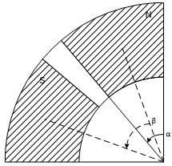

    : visioda çizilmiş.

Yukarıdaki şekilde görüleceği üzere, α mıknatıs açısı veya mıknatıs adımı (magnet pitch, pole arc, magnet arc vb.), β ise kutup adımı (pole pitch) olarak adlandırılmaktadır.

Her bir iletken katmana gelen alan dağılımını hesaplamak uygundur. Mıknatıslara en yakın iletken katman için farklı kutup açısı/kutup adımı oranlarında alan dağılımı grafiği aşağıdaki gibidir [74].

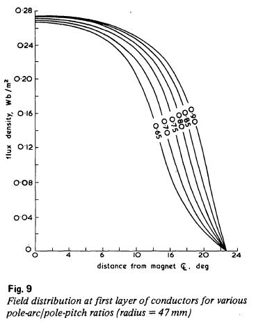

    : p20.

Grafiğe bakılırsa kullanışlı akı oran arttıkça artmaktadır. Ancak bu kazanç yüksek oranlarda daha az elde edilmeye başlamaktadır. Çünkü bitişik mıknatıslar arasındaki kaçak akı artmaktadır. Böylece mıknatıs malzemesi daha verimsiz kullanılmış olmaktadır. Bundan dolayı bu oranın 0,8 olarak alınması iyi bir seçim olacaktır [74, 61]. Mıknatıs açısı/kutup adımı oranı trapezoidal bir mmk alanı oluşturmaktadır [61].

Güç Hesabı
----------

Eksenel akılı bir makinenin elektriksel güç eşitliği eşdeğer ölçüde radyal makineden dönüştürülebilir [61].

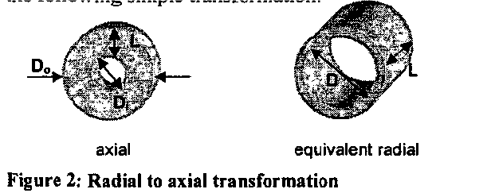

    : p21.

Eşdeğer çapı şöyle elde edebiliriz:

.. math::

    D=\frac{D_o+D_i}{2}

Benzer şekilde radyal makinenin uzunluğunu da şu şekilde dönüştürebiliriz:

.. math::

    L=\frac{D_o-D_i}{2}

Böylece eksenel akılı makinenin elektriksel eşitliği radyal makine eşitliği cinsinden dönüşümü şöyledir:

.. math::

    S=2,74K_wBQn\left(D_o+D_i\right)^2\left(D_o-D_i\right)

Burada, B manyetik yükleme (T), Q elektrik yükleme (A/m), n dönüş hızı (rps)'dir.

Eksenel akılı makinelerde maksimum tork \sfrac{D_o}{D_i}=\sqrt3 sağlandığında elde edilir [88, 61].

Örneğin; 3kW'lık bir makine için güç hesabı yapılırsa, makinenin %90 verimle ve tam güçte birim güç faktörü ile çalıştığı düşünülebilir. Böylece başlangıç tasarım parametresi olarak S=3,3kVA alınabilir. Literatürdeki benzer ölçüdeki makinelere bakıldığında sargı katsayısı Kw=0,966, manyetik yük B=0,6 T elektrik yük Q=11000 Aconds/m kullanılmıştır [61].

Elektriksel Sistem
------------------

Basit üç fazlı tek katmanlı sargı kullanıldığında faz gerilimi eşitliği aşağıdaki gibidir [61]:

.. math::

    E_p=4.44K_wfN_s\phi

Buradaki değişkenler:

- E_p	faz gerilimi [V]
- K_w	sargı katsayısı
- f	kaynak frekansı [Hz]
- N_s	her fazdaki seri tur sayısı
- \phi	akı bağlantısı [Wb]

Tasarlanan makinenin gücü ise (diğer senkron makineler gibi tam yükte birim güç katsayısına ulaştığı farzedilir, şu formül yardımıyla hesaplanır [61]: 

.. math::

    P=\sqrt3V_lI_l\cos{\varphi}

Buradaki değişkenler:

- P	nominal güç [W]
- V_l	hat gerilimi [V]
- I_l	hat akımı [A]
- \cos{\varphi}	güç katsayısı

Nüveli Yapı
-----------

Manyetik Sistem

Yüzeye yapıştırılmış sürekli mıknatıslar manyeto motif kuvvet (mmk) oluşturmak için kullanılırlar. Alan oluşturan mıknatıslar rotor üzerindedir. Mıknatıslar ve mıknatısların arkasındaki çeliğin toplam ağırlığı lamine çelik statora göre daha düşüktür [61]. 

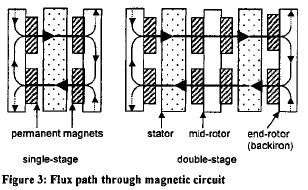

    : p22.
 
Yukarıdaki şekilde hem tek katmanlı hem de çift katmanlı yapı için akı yolu gösterilmektedir [61]. İlk mıknatıstan başlayan akı statoru geçtikten sonra eksenel doğrultuda tam karşısındaki ikinci mıknatısa ulaşır. Buradan mıknatısın arka çeliği içinden bitişikteki mıknatısa dairesel olarak gelir. Bitişikteki mıknatıs tan sonra tekrar statordan geçerek karşı mıknatısa ulaşır ve tekrar rotor çeliği içinden yol tamamlanır.

Hava aralığının manyetik direnci nüvenin (çeliğin) manyetik direncinden (\mu_r=5000) çok büyük olduğu için bütün üretilen mmk'in hava aralığına düştüğü varsayılır. Böylece, mıknatıs kalınlığının hava aralığına bağlı fonksiyonu şu şekilde verilir:

.. math::

    l_m\approx\ \frac{A_mB_ml}{\mu_0A_pH_m}

Buradaki değişkenler:

- l_m	mıknatıs uzunluğu [m]
- l 	hava aralığı uzunluğu [m]
- A_m 	mıknatıs yüzey alanı [m2]
- A_p 	kutup kesit alanı [m2]
- B_m	mıknatıs akı yoğunluğu [T]
- H_m	mıknatıs alan şiddeti [A.tur/m]
- \mu_0	havanın manyetik geçirgenliği [4π.10-7]

Mıknatısın yüzey alanı A_m mıknatısın adımına (pitch) bağlıdır. Mıknatıslar arasındaki mesafe tam kutup adımı, yani komşu iki mıknatıs tam olarak birbirine yapışık, ise yüksek bir akı kaçağına sebep olur. Mıknatıs adımı \sigma_m ile kutup adımının \sigma_p\ oranının seçimi, trapezoidal bir mmk alanı verir [74],  bitişik iki kutup arasındaki kaçak akıyı azaltır. Bu kaçağı en aza indiren değer:

.. math::

    \frac{\sigma_m}{\sigma_p}=0,8

Tek Rotor Çift Stator
---------------------

Bu yapının avantajı daha az sayıda mıknatıs ile gerçekleştirilmesidir. Ancak en büyük dezavantajı ise sargı düzeninden kaynaklanan, sargı sonlarının oldukça uzun olmasıdır. Böylece makinede tork üretmek için kullanılan sargılar zayıf bir şekilde gerçekleştirilmektedir [3].

Yumuşak Manyetik Kompozit (SMC) Malzemeler
------------------------------------------

Yumuşak manyetik kompozit (SMC) malzemelerin düşük-orta frekans özellikleri oldukça iyidir [6].

Tablo 4 1  SMC malzemelerin avantaj ve dezavantajları

Avantajlar	

- Üç boyutlu izotropik manyetik özelliğe sahiptir. Böylece manyetik devre tasarımında avantaj sağlar.	
- Üretimi kolaydır. Oldukça karmaşık şekiller ölçülerinde iyi tolerans ile kolayca üretilebilir.
- Malzemenin toz yapısından dolayı düşük eddy akımı kayıpları vardır. Makinenin verimini artırır.

Dezavantajlar

- Manyetik iletkenliği zayıftır.
- Akı yoğunluğunun doyumu lamine çeliğe göre düşüktür.
- Yüksek histerisis kayıpları vardır.
- Epoksi yapıdan ötürü çeliğe göre kırılgan bir malzemedir.

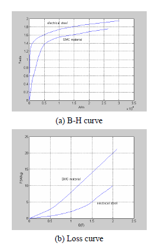

    : Şekil 4.1  Elektrik çeliği ve SMC malzemenin karşılaştırılması.

Grafiklerde görüldüğü üzere SMC malzeme elektrik çeliğine göre oldukça zayıftır. Bu zayıflığı telafi etmek için manyetik akı yolu mümkün olduğunca kısa ve nüve en az ağırlıkta tasarlanmalıdır [6].

Uygulamalar
-----------

Yüksek Hızlı Üreteçler

Yüksek hızlı üreteçlerde genellikle küçük gaz türbinleri kullanılmaktadır. 

Gaz türbinleri üreticileri:

- http://www.wrenturbines.co.uk/engines/turbojet/wren-160
- http://www.behotec.de/xtcommerce/index.php
- http://www.bladonjets.com/technology/gas-turbines/
- http://www.amtjets.com/Titan.php

Elektrikli araçlar

2006 yılında yakıt hücreli ve hibrit araçlar için direk tahrikli bir teker motor GM tarafından yapılmıştır. Bu makine tasarımında makinenin yüksek hız verimliliğini ve sabit güç aralığını geliştirmek için makine indüktansını artıran teknikler uygulanmıştır. Uygulanan teknikler dönme kayıplarını azalttığı için ayrıca verimliği artırmıştır [120]. Yine bu çalışmada vuruntu momentini azaltmak için rotordaki mıknatıslar iki gruba ayrılmış, her bir mıknatısın adım aralığı 2π/pz kadar azaltılmıştır. p kutup çifti sayısı ve z de oluk sayısıdır [120]. 

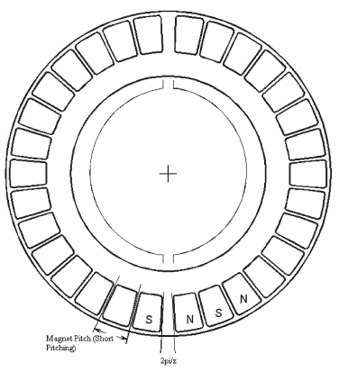

    : Şekil 4.3 Vuruntu momentini azaltmak için mıknatıs kısa adım aralığı yöntemi.

Buna rağmen oluk etkisi halen mevcuttur ve mıknatıs akısı tarafından indüklenen eddy akımlarından dolayı boşta dönme kayıpları artmaktadır. Tüm bu problemleri aşmak için stator oluklarına manyetik kamalar yerleştirilmiştir [120]. Seçilen manyetik kamalar havadan çok daha fazla manyetik geçirgenliğe sahiptir. Lakin statorda kullanılan lamine çelikten ise çok azdır. Manyetik kamadaki bu seçim manyetik kama içindeki kaçak (kısa devre) akıyı azaltmaktadır fakat makine indüktansını yeterli düzeyde artırmaktadır. Seçilen malzemenin manyetik geçirgenliği lamine çeliğe göre düşük olduğu için doyuma ulaşmaz, böylece bütün tork seviyelerinde kaçak akı (indüktansı artırmak için) için bir yol sağlamış olur. Makine indüktansını artırmak yüksek hızdaki sabit gücü ve yüksek hız verimliliğini artırmaktadır. 

Manyetik kamaların bir diğer avantajı ise makinenin geri EMK'ini artırmasıdır, böylece mıknatısı ve maliyeti artırmadan torku artırmaktadır. Bu geri EMK'in artırılması oluklara yerleştirilen manyetik kamaların, makinenin manyetik devresinin manyetik geçirgenliğini artırdığı için sağlanmıştır.

Bu manyetik kamanın seçilmesi malzeme içindeki eddy kayıplarını azaltmaktadır. Histerisis kayıpları mevcuttur ancak bu makinenin frekans aralığında bu kayıp çok azdır ve önemli bir kama ısınması bulunmamaktadır.

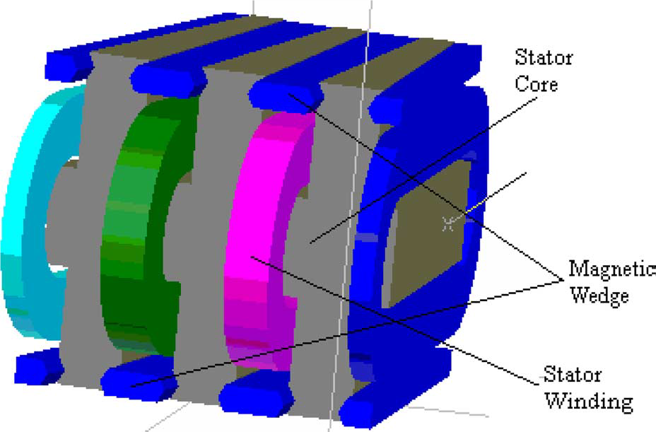

    : Şekil 4.4 Stator oluklarına yerleştirilmiş manyetik kamalar.

Nüvesiz Yapı
------------

Kimi zaman nüvesiz eksenel akılı makineler bazı üstün avantajlarından dolayı kullanılmaktadır. Nüvesiz geometri nüve kayıplarını ve vuruntu momentini ortadan kaldırmaktadır. Nüve olmadığı için çok hafif olmasından dolayı makinenin tork yoğunluğu oldukça yüksektir. Ancak nüvesiz yapıda sargılar havada olduğu ve direk mıknatıs akısına maruz kaldığı için bazı sorunlar ortaya çıkmaktadır. Sonuç olarak nüvesiz yapı son derece düşük makine indüktansına sahiptir dolayısıyla çok zor sabit güç aralığına sahip olur. Bu problemin üstesinden gelmek için makine eviricisi büyütülmelidir. Nüvesiz yapıda herhangi bir nüve kaybı olmamasına karşın sargılardaki "eddy-induced current"'den dolayı belirgin bir kayıp vardır [120].

Armatürdeki demir ortadan kalkar, böylelikle buna bağlı eddy akımları ve histerisis kayıpları önemsiz hale gelir [74].

Nüve kayıpları olmadığı için bu tipteki üreteçler geleneksel makinelere göre daha yüksek verimde 

Teori
-----

Nüvesiz yapıda tek rotor tek statorlu yapı Şekil 5.1'de görülmektedir [4]. 

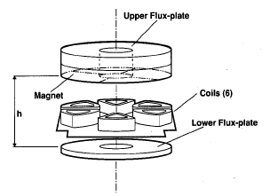

    : Şekil 5.1  Nüvesiz Tek rotor Tek statorlu yapı [4].

Normal çalışmada, sargılar bir kutuptan diğerine geçerken senkron biçimde enerjilendirilir ve oluşan alan mıknatıslar üzerinde bir tork oluşturur [4]. Eksenel akılı makinelerde alan şiddetini hesaplamak için pratik bir yöntem sunulmuştur [4].yöntem iki aşamadan oluşmaktadır. İlk aşamada motorun sargı bölgesindeki (hava aralığı) alanın analitik ifadeleri türetilmektedir. 

Makine Parametreleri
--------------------

Nüvesiz disk armatürün doğası gereği bitişik bobin kenarları arasında kullanılmayan atıl bir boşluk vardır. Makinenin etkin çalışma bölgesinin dış çapı (D2) iç çapından (D1) çok büyükse, D2>>D1, bu atıl alan artacaktır. Eğer D1 ile D2 birbirine çok yakın olursa da etkin alan çok küçük olacaktır. Sonuç olarak çıkış gücünü azami yapan oran şu şekilde verilmiştir: [64]

.. math::

    D2=\sqrt3D1

Hava aralığındaki alanın analitik ifadeleri
-------------------------------------------

Motordaki alanı modellemek için ilk olarak üç boyutlu model iki boyutlu sınır koşullu probleme indirgenmiştir. Daha sonra değişkenleri ayırma yöntemi ile alan ifadeleri elde edilmiştir [4]. iki boyutlu geometrik yapı gösterimi ve indirgenmiş iki boyutlu yapı şekilde görülmektedir [4]. 

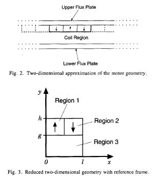

    : Şekil 5.2 İki boyutlu yapı ve indirgenmiş iki boyutlu yapı.

Şekil 5.2'de x ekseni mıknatısların tam ortasından alınmış yayın uzunluğu, l iki mıknatısın yay uzunluğu, g hava aralığını ve h-g de mıknatıs kalınlığını vermektedir.
Burada mıknatısların bulunduğu halkanın R1 dış yarıçapı ve R2 nin de iç yarıçapı olduğu ve N_{pole}'un toplam kutup sayısı olduğu düşünülürse[4]: 

l=\frac{\pi(R_1+R_2)}{N_{pole}}	(46)

ve x değişkeni yay boyunca açı ile orantılıdır[4].

\theta=\frac{x}{l}\frac{2\pi}{N_{pole}}	(47)

Verilen bu geometriye göre akım olmayan bölgelerdeki magnetostatik alan denklemlerinin analizi ile başlarız[4]:

\nabla\times H=0	(48)

ve 

\nabla\bullet B=0	(49)

H manyetik alan şiddeti ve B de manyetik akı yoğunluğudur. Manyetik malzemelerde bu iki alan H ve B fiziksel manyetizasyon yoğunluğu M ile ilişkilidir[4]. 

B=-\mu_0(H+M)	(50)

B ve H'yi direk çözmek yerine alternatif bir yaklaşım ile skaler potansiyel \Phi kullanılabilir[4].

H=-\nabla\Phi	(51)

Bu eşitliği bir önceki denklemde yerine yazarsak, alan problemi ikinci dereceden skaler bir eşitliğe dönüşmektedir[4].

\nabla^2\Phi=-\nabla\bullet M	(52)

Bu eşitlik, ilk üç eşitliği içermektedir. Böylece yukarıdaki indirgenmiş geometriye direk olarak uygulanabilmektedir. İndirgenmiş geometride, Şekil 5.2'de de görüldüğü gibi üç bölge bulunmaktadır. Bu bölgeler için manyetizasyon şu şekildedir[4]:

M=\left\{\begin{matrix}M_y\ (Region\ 1)\\-M_y\ (Region\ 2)\\0\ (Region\ 3)\\\end{matrix}\right.	(53)

Burada mıknatısın ideal olduğu ve her yerinin aynı şekilde manyetize olduğu kabul edilmiştir. Üstelik manyetizasyon her bölgede homojen olduğu için (20) numaralı eşitlik Laplace eşitliği halini alır [4]:

\nabla^2\Phi=0	(54)

İki boyutlu problemler için bu denklemin kartezyen koordinatlardaki genel çözümü iyi bilinmektedir. Özel olarak üç bölge için genel çözümler şöyledir [4].

\Phi_1\left(x,y\right)=\left(S_{11}e^{k1y}+S_{12}e^{-k1y}\right)\sin{\left(k_1x\right)}+\left(C_{11}e^{k1y}+C_{12}e^{-k1y}\right)\cos{\left(k_1x\right)}\ \ \ (R1)	(55)

\Phi_2\left(x,y\right)=\left(S_{21}e^{k2y}+S_{22}e^{-k2y}\right)\sin{\left(k_2x\right)}+\left(C_{21}e^{k2y}+C_{22}e^{-k2y}\right)\cos{\left(k_2x\right)}\ \ \ (R2)	(56)

\Phi_3\left(x,y\right)=\left(S_{31}e^{k3y}+S_{32}e^{-k3y}\right)\sin{\left(k_3x\right)}+\left(C_{31}e^{k3y}+C_{32}e^{-k3y}\right)\cos{\left(k_3x\right)}\ \ \ (R3)	(57)

Katsayılar ve değişkenler uygun sınır koşulları ile birlikte belirlenmektedir [4].

Sınır Koşulları:

Üç bölge dikdörtgen bir alan oluşturacak şekilde dört çizgi ile sınırlandırılmıştır. Dikdörtgenin yüzleri y ekseni ve x=l ekseni ile tanımlanmıştır ve bu yüzey boyunca alanın normal bileşeni Hn sıfırdır [4].

Not: İki boyutlu problemde normal bileşen yüzeye dik olan bileşendir, teğetsel bileşen ise x ve y yönlerine doğru olan bileşendir.

Dikdörtgenin alt ve üstü akının geçişi için manyetik çelik malzeme ile çerçevelenmiştir. Kolaylık olması açısından çelik malzemenin geçirgenliği sonsuz (μ=0) kabul edilmiştir. Böylece alanın teğetsel bileşeni sınır üzerinden yok olacaktır[4].

Bu sınır koşullarını uygulamak, genel çözümü indirgeyip kısmi çözümü hesaplamak için yeterlidir. Ancak daha anlaşılır olması açısından sınır koşulları her bölge için ayrı ayrı uygulanmıştır [4].
Bölge 1: 1. bölgenin sınırlarından biri olan g<y<h ekseni boyunca alanın normal bileşeninin (H1n) sıfır olması: 

H_{1n}\left(0,y\right)=0,\ \ \ g<y<h	(58)

Bu sınır koşulunu (23)'e uygularsak

S_{11}e^{k1y}=-S_{12}e^{-k1y}	(59)

Bölge aynı zamanda y=h boyunca manyetik çelik malzeme ile sınırlıdır. Alanın teğetsel bileşeni (H1t) bu doğrultu boyunca da sıfırdır [4].

H_{1t}\left(x,h\right)=0,\ \ \ 0<x<l/2	(60)

Bu durumdu şu eşitlik ortaya çıkar:

C_{11}e^{k1h}=-C_{12}e^{-k1h}	(61)

(27) ve (29) numaralı denklemler genel çözümde yerlerine yazılırsa daha özel bir çözüm ortaya çıkar [4].

\Phi_1\left(x,y\right)=C_1\sin{h\left(k_1(y-h)\right)}\cos{\left(k_1x\right)}	(62)

Burada önceki eşitliklerdeki katsayılar C1 içine toplanmıştır.

Bölge 2: Buradaki koşullar birinci bölgedekine benzer şekildedir. x=l boyunca alanın normal bileşeni birinci bölgedeki gibi simetrik bir şekilde sıfırdır. Ayrıca y=h boyunca teğetsel bileşen de sıfırdır.

H_{2n}\left(l,y\right)=0,\ \ \ g<y<h	(63)

ve

H_{1t}\left(x,h\right)=0,\ \ \ l/2<x<l	(64)

Bu koşullar genel çözüme uygulandığında:

S_{21}e^{k2y}=-S_{22}e^{-k2y}	(65)

ve

k_2=\frac{n\pi}{l},\ \ \ n=1,2,3,\ldots	(66)

ikincisi

C_{21}e^{k2h}=-C_{22}e^{-k2h}	(67)

(33) ve (35) numaralı denklemler arasındaki ilişki (24) numaralı genel çözümü şu hale indirger:

\Phi_2\left(x,y\right)=C_2\sin{h\left(\frac{n\pi}{l}(y-h)\right)}\cos{\left(\frac{n\pi}{l}x\right)}	(68)

İki mıknatıs arası: iki mıknatıs arasındaki sınırda akı yoğunluğunun normal bileşeni ve alan şiddetinin teğetsel bileşeni sürekli olmak zorundadır [4]. Yani, süreklilik için bu sınırda eşit olmaları gerekir.

B_{1n}\left(y,l/2\right)=B_{2n}\left(y,l/2\right),\ \ \ g<y<h	(69)

ve

H_{1t}\left(y,l/2\right)=H_{2t}\left(y,l/2\right),\ \ \ g<y<h	(70)

devamında,

C_1=C_2	(71)

ve

k_1=k_2	(72)

Böylece sonuç her iki bölgede aynıdır ve \Phi_{mag} ile ifade edilecek olursa;

\Phi_{mag}\left(x,y\right)=\sum_{n=1}^{\infty}{C_{mag,n}\sin{h\left(\frac{n\pi}{l}(y-h)\right)}\cos{\left(\frac{n\pi}{l}x\right)}}	(73)

Bölge 3: bölge 3 için iki sınır koşulu, alanın simetrik olduğu ve normal bileşenin sıfır olduğu geçerlidir. Bu dikey sınırlar x=0 ve x=l sınırlarıdır. Böylece;

H_{3n}\left(0,y\right)=0,\ \ \ 0<y<g	(74)

ve

H_{3n}\left(l,y\right)=0,\ \ \ 0<y<g	(75)

Bu koşullar genel çözüme uygulandığında;

S_{31}e^{k3y}=-S_{32}e^{-k3y}	(76)

ve

k_3=\frac{n\pi}{l},\ \ \ n=1,2,3,\ldots	(77)

Daha sonra tabandaki sınırlar sonsuz manyetik geçirgenliğe sahip bir malzeme ile olduğu için, alanın teğetsel bileşeni sıfır olmaktadır:

H_{3t}\left(x,0\right)=0,\ \ \ 0<x<l	(78)

Bunun sonucunda,

C_{31}e^{k3h}=-C_{22}e^{-k2h}	(79)

Genel çözüme uygulandığında da;

\Phi_{gap}\left(x,y\right)=\sum_{n=1}^{\infty}{C_{gap,n}\sin{h\left(\frac{n\pi}{l}(y-h)\right)}\cos{\left(\frac{n\pi}{l}x\right)}}	(80)

Mıknatıs-hava aralığı sınırı: burada H'nin teğetsel bileşeni sürekli olmak zorundadır:

H_{mag,t}\left(x,g\right)=H_{mag,t}\left(x,g\right),\ \ \ 0<x<l	(81)

Bu koşulda, (0,l) boyunca sin(\frac{n\pi}{l}) fonksiyonu ortogonaldir:
 
C_{mag,n}=C_{gap,n}\frac{\sinh\funcapply(\frac{n\pi g}{l})}{\sinh\funcapply(\frac{n\pi(g-h)}{l})}	(82)

Ek olarak B'nin de normal bileşeni sürekli olmak zorundadır. 

B_{mag,n}\left(x,g\right)=B_{gap,n}\left(x,g\right),\ \ \ 0<x<l	(83)

Böylece 

B_{mag,n}=\left\{\begin{matrix}\mu_0\left(H_{mag,n}+My\right),\ \ \ 0\le x<l/2\\\mu_0\left(H_{mag,n}-My\right),\ \ \ l/2<x<l\\\end{matrix}\right.	(84)

Daha sonra (51) şuna indirger:

\sum_{n=1}^{\infty}\frac{n\pi}{l}C_{gap,n}K\left(n,h,g,l\right)\cos{\left(\frac{n\pi x}{l}\right)}=\left\{\begin{matrix}M,\ \ 0\le x<l/2\ \\-M,\ \ \ \ \ \ \ l/2<x<l\\\end{matrix}\right.	(85)

burada

K\left(n,h,g,l\right)=\cosh{\left(\frac{n\pi g}{l}\right)}-\sinh{\left(\frac{n\pi g}{l}\right)}\bullet\coth{\left(\frac{n\pi}{l}(g-h)\right)}	(86)

Tekrar \cos{\left(\frac{n\pi x}{l}\right)}'in (0,l) boyunca ortogonal olmasından faydalanılırsa; 

C_{gap,n}=\frac{2M}{n\pi K(n,h,g,l)}\left\{\int_{0}^{l/2}{\cos{\left(\frac{n\pi x}{l}\right)}dx}-\int_{l/2}^{l}{\cos{\left(\frac{n\pi x}{l}\right)}dx}\right\}	(87)

integralinin sonucu:

C_{gap,n}=-\frac{4lM{(-1)}^{(n-1)/2}}{\left(n\pi\right)^2K(n,h,g,l)},\ \ \ n=1,3,5,\ \ldots	(88)

Sonunda hava aralığının çözümü tanımlanmış olur. 

Alan Formülü:

(56) numaralı denklemdeki sonucu (48) numaralı genel çözüme uygularsak, hava aralığının tam çözümünü elde edebiliriz. 

\Phi_{gap}\left(x,y\right)=-\frac{4}{M}\sum_{n=1,3,5\ldots}^{\infty}{\frac{{(-1)}^{(n-1)/2}}{\left(n\pi\right)^2K(n,h,g,l)}\bullet\sinh{\left(\frac{n\pi y}{l}\right)}\cos{\left(\frac{n\pi x}{l}\right)}}	(89)

Böylelikle bu bölgedeki alanın dikey veya eksenel bileşeni:

B_{gap,y}\left(x,y\right)=-4\mu_0M\sum_{n=1,3,5\ldots}^{\infty}{\frac{{(-1)}^{(n-1)/2}}{n\pi K(n,h,g,l)}\bullet\cosh{\left(\frac{n\pi y}{l}\right)}\cos{\left(\frac{n\pi x}{l}\right)}}	(90)

Burada, x mıknatısın orta çapından geçen daire üzerindeki bir yay boyunca yatay mesafeyi, y de alt çeliğin üzerindeki dikey mesafeyi verir ve diğer değişkenler de şu şekildedir:

- M	manyetizasyon (A/m)
- g	hava aralığı (m)
- lm	mıknatıs yüksekliği (m)
- h	g + lm (m)
- l	[pi(R1+R2)/Npole] (m)
- R1	mıknatısların bulunduğu halkanın iç yarıçapı (m)
- R2	mıknatısların bulunduğu halkanın dış yarıçapı (m)
- Npole	kutup sayısı

Gerilim Modeli [5]
------------------

İki mıknatıs arasında, hava aralığındaki sargıların bir telinde indüklenen gerilim (Şekil 5.6'de görülen 1-1' boyunca) şu şekilde verilmektedir [5]: 

e_{{11}^\prime}\left(\psi\right)=0.5\omega_mB_gcos\phi sin\psi\int_{R_2}^{R_1}rdr	(91)

Bg hava aralığındaki manyetik akı yoğunluğudur (Wb/m2). Bunun integrali alındığında:

e_{{11}^\prime}\left(\psi\right)=0.5\omega_mB_gsin\psi\left(R_2^2-R_1^2\right)	(92)

Şekil 5.6'deki 2-2' boyunca indüklenen gerilim de şu şekildedir:

e_{{22}^\prime}\left(\psi\right)=0.5\omega_mB_g\left(R_2^2-R_1^2\right)\sin{\left(180-\psi\right)}	(93)

Böylelikle iki kısımdaki toplam indüklenen gerilim şöyle olur:

e\left(\psi\right)=e_{{11}^\prime}\left(\psi\right)+e_{{22}^\prime}\left(\psi\right)	(94)

Böylece, tek faz bobindeki pNt iletken için Ns stator kısmının toplam rms indüklenen armatür gerilimi şöyledir:

E_{A,rms}=0,353pN_tN_s\omega_mB_g\left(R_2^2-R_1^2\right)	(95)

- E_{A,rms}	üretecin faz başına rms armatür gerilimi
- Nt	dalga sargının bir fazındaki tur sayısı
- Ns	stator katmanı (stator sayısı)
- wm	mekanik dönme hızı (rad/s)
- p	üretecin her bir rotorundaki kutup sayısı

Elektrik Yükü ve Mıknatıs Boyutu Optimizasyonu:

Yukarıdaki eşitliğe göre, düzgün bir güç faktörü ve sargılarda herhangi bir gerilim düşümü olmadığı farz edilerek, güç çıkışı Pout şöyledir: 

P_{out}=3\times E_{A,rms}I_A	(96)

P_{out}=3\times\left[0,353pN_tN_s\omega_mB_g\left(R_2^2-R_1^2\right)\right]I_A	(97)

Statorun iç yarıçapındaki q elektrik yüklenmesi şöyledir:

q=\frac{3I_ApN_t}{2\pi R_1}	(98)

Bu denklemi çıkış gücü denkleminde yerine yazar ve tekrar düzenlersek:

P_{out}=0,707\pi qN_s\omega_mB_gR_2^3k_r\left(1-k_r^2\right)	(99)

Burada k_r=R_1/R_2 olmak üzere, ifadeyi daha sade bir şekilde şöyle ifade edilebilir:

P_{out}=Ck_r\left(1-k_r^2\right)	(100)

Bu eşitlikten dPout/dkr=0 ile çıkış gücünün maksimum değeri için gerekli kr değeri elde edilebilir. Buradan R1 ve R2 bulunduktan sonra mıknatısın eksenel uzunluğu lm hesaplanabilir:

l_m=\frac{B_gl_g}{B_r-B_g}	(101)

l_g=3\left(b_fd_b+t_f+t_r+c_s\right)+2c_g	(102)

- lg	etkin hava aralığı
- bf	sargı geri katsayısı (winding backing factor) (%1,2~1,3)
- db	sargı balyasının çapı
- tf	sargının eksenel kalınlığı
- tr	epoksinin yüzey kalınlığı
- cs	faz katmanlarının arasındaki soğutma mesafesi
- cg	stator ile rotor arasındaki boşluk

Mıknatısın iç yarıçapı R1 şu şekilde hesaplanabilir:

R_1=R_b+N_td_bb_f+c_g	(103)

Kendi endüktansı Lss ve armatür endüktansı Lsr stator ve mıknatıs geometrileri ele alınarak türetilmiş ve sırasıyla şu şekilde hesaplanmıştır:

L_{ss}=\frac{N_t^2p^2\mu_0\left(R_2-R_1\right)\left(t_f+d_b\right)}{8\pi R_m}	(104)

L_{sr}=pN_t^2\left[\frac{1}{\mathfrak{R}_g+\mathfrak{R}_m}\right]	(105)

Burada hava arlığı ve mıknatıs manyetik dirençleri sırasıyla;

\mathfrak{R}_g=l_g/(\mu_0A_g)\  ve \mathfrak{R}_m=l_m/(\mu_0A_m)'dir. 

Son olarak sargı kayıpları ve eddy akımı kayıpları sırasıyla şu eşitliklerden elde edilebilir:

P_w=0,0311\left(s/R\right)^{-0,25}\mu^{0,25}\rho_a^{0,75}\omega_m^{2,75}R^{4,5}	(106)

P_e=B_p^2\omega_e^2d^2/32\rho	(107)

Eşdeğer Devre Modeli
--------------------

İki rotorlu nüvesiz yapıda bir makinenin radyal kesiti ve akı yolları Şekil 5.3'de görülmektedir [12].
 
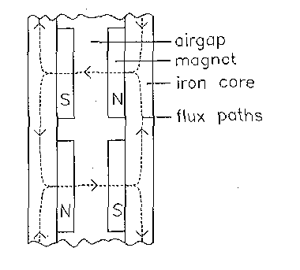

    : Şekil 5.3 Nüvesiz iki rotorlu makinenin radyal kesiti ve akı yolları [12].

Ek olarak bu kesit için eşdeğer devre modeli de şekilde görülmektedir [12].

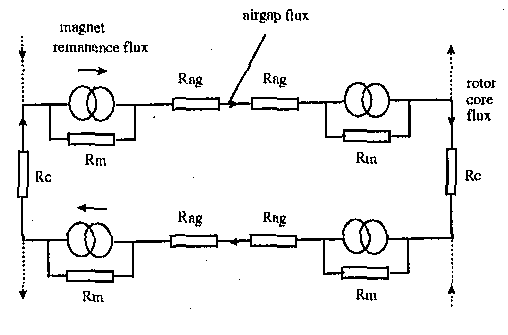

    : Şekil 5.4  Nüvesiz iki rotorlu yapının eşdeğer devre modeli [12].

Bu topolojide büyük mıknatıslar ve hava aralığından dolayı mıknatıs ve hava aralığı dirençleri (Rm ve Rag) çeliğin direncini (Rc) bastırır. Bu nedenle hava aralığının akı yoğunluğunu hassas bir şekilde belirlemek için eşdeğer devre modeli kullanılabilir. Rag hesaplanırken hava aralığı alanı mıknatısın yüzey alanına eşit alınır [12].

Çeliğin manyetik direncini hesaplamak için çeliğin manyetik geçirgenliği kullanılır. Çeliğin manyetik geçirgenliği başlangıçta iteratif olarak çeliğin akı yoğunluğu (1) denklemini ve BH eğrisini sağlayacak şekilde hesaplanır [12]. 

Uygulamalar
-----------

5.2.1	Yüksek Hızlı Makineler

Yüksek hızlı eksenel akılı üreteçler mikrotürbinlerde kullanılır (dağıtılmış güç üretim sistemi). Böylelikle dişli kutusu olmadığı için önemli ölçüde ağırlık ve boyutu azalmış olur [5].  Dağıtılmış güç üretim sistemi ise şebeke gücünün olmadığı uzak ve afet bölgelerinde kullanılır [142].

Yüksek hızlı makinenin tasarımı, yüksek rotor hızı ve statordaki akı değişiminin yüksek frekansından dolayı geleneksel düşük hızlı ve düşük frekanslı makinenin tasarımından biraz farklıdır [142].

Çok yüksek merkezkaç kuvvetinden dolayı mıknatısların rotora gömülü olmasına ihtiyaç vardır [5].

5.2.1.1	Yüksek hızlı eksenel akılı sm üreteç [142, 144]

Bu çalışmada 50.000 d/d, 50kW ve 400 Voltluk bir üreteç tasarımı sunulmuştur. Makinen tüm elektromanyetik modeli (manyetik dirençler) elde edildikten sonra, basit bir model ortaya konmuştur. Model şekildeki gibidir:

Bu model kullanarak makinenin akı yoğunluğu (Br) elde edilebilir. Daha sonra Br ile gerilimi ve stator sargıları eddy kayıpları hesaplanabilir. 

Stator akımı çıkış gücünden (daha önce verilen giriş parametrelerinden) elde edilebilir. Böylece stator sargı kayıplarına (I2R) ulaşılmış olur. 

Verimliliğin hesaplaması çıkış gücü ve tüm kayıplar ile kolayca sağlanabilir. 

Bu çalışmada FEM simülasyonu sonunda akı yoğunluğu modelde hesaplanan akı yoğunluğuna yakın çıkmıştır. (modeldeki B=0,5162 ve FEM sonucundaki B=0,427)

Tasarlanan üretecin giriş verileri şu şekildedir:

Tablo 5 1  Yüksek hızlı SM üretecin giriş verileri

- Pout	50.000	W
- V	400	Volt
- Nph	3	phases
- Nm	50.000	rpm
- Nstack	2	2 stator with 3 rotor
- p	6	Number of poles
- g	3	mm (air gap)
- Br	1,2	For PM

5.2.1.2	Yüksek hızlı eksenel akılı sm üreteçin modüler tasarımı [5]

[5] numaralı uygulamada 50kVA, 420V, 3 faz ve 50.000 d/d hızında bir üreteç tasarımı sunulmuştur.

Bu tarz yüksek hızlı üreteçlerdeki en önemli tasarım parametresi olan verilen hızdaki birim hacim başına güç çıkışı, elektrik yükü ve manyetik yükü ile ilişkilidir [5].

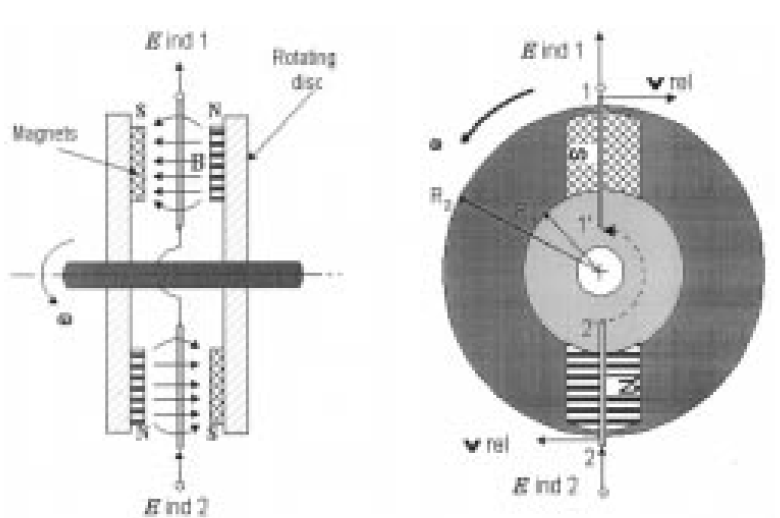

    : Şekil 5.6  Yüksek hızlı eksenel akılı üreteç [5].

