Winding
=======

# The windings used in rotating electrical machines can be classified under two main headings: Concentrated and Distributed windings. #reviewden

# Takano et al. investigated optimum values for magnet and armature winding thickness for one rotor one stator motors. Armature winding resistance, current and distribution of air gap magnetic flux density were determined analytically. In addition, starting torque expression was introduced. In order to keep the copper loss of armature winding minimum, the optimal ratio of the PM thickness to armature winding thickness is 2:1. The main drawback of calculations is some variables in equations should be measured from base motor for determining its values. There was a base motor that was measured for determining constants in equations and three motors for calculations [Takano et al., 1992]. #reviewden

# Reed and Bakhoum investigated performance of PCB stator AFPM generator. Three phase steady state model was used. Power curve and some oscilloscope views of 16 poles, 4 coils per phase, 100 W at 500 rpm generator. Four layer PCB was constructed. They used off grid small wind turbine applications [Reed and Bakhoum, 2008]. #reviewden

# Del Ferraro et al. investigated coil and magnet shape optimization of ironless AFPM machine. 3D FEA was used for analysis. Also torque equation was converted and it depends only coil shape. Optimization was carried out in terms of maximum torque produced per joule loss. Coil and magnet shape optimization and pole number effect on machine torque graphs were presented. Comparisons among different coil and magnet shapes that trapezoidal, rhomboidal, hexagonal and circular coils and trapezoidal, rectangular and circular magnets. In this work radial length and axial thickness were fixed. In conclusion, they noted that, best performances in terms of torque produced can be optained with circular shapes both on magnets and coils [Del Ferraro et al., 2007]. #reviewden

# Kamper et al. investigated analysis of air cored nonoverlapping concentrated stator windings. Analytic calculations and 2D FEA were presented. Element, layer, coil and phase voltage steps were used for voltage calculations. In addition, stator winding factors were investigated in detail. Per unit torque and mass of copper graphs for different windings were also given. Compared with the torque performance of three different windings that were normal overlapping, concentrated coil and phase group windings. Concentrated windings had better torque performance than with normal overlapping windings. Also, they noted that higher pole number machines use less copper then low pole number machines [Kamper et al., 2008]. #reviewden

The windings used in rotating electrical machines can be classified under two main headings: Concentrated and Distributed windings. 

Hava nüveli sargılar daha düşük indüktansa sahiptir. [Caricchi et al., 1996]

Hava aralığındaki sargıların artılarını ve eksilerini belirlemek nispeten karmaşıktır. Genel manada artıları şu şekilde özetlenebilir [Lovatt et al., 1998]:

- Belirli derinlikteki bir olukla karşılaştırıldığında sargılar için daha fazla yer vardır.
- Nüveli yapıda, dişlerde daha yoğun akı bulunmaktadır. Böylece demir kayıpları daha fazladır. (hava nüveli sargılarda demir olmadığı için kayıplar sıfırdır)
- Demir bir nüve olmadığı için ağırlık azalmaktadır.

Aynı zamanda eksilerini de şöyle özetleyebiliriz [Lovatt et al., 1998]:

- Sargılar derindeyse termal performansı zayıflamaktadır.
- Belirli mıknatıslar için akı yoğunluğu düşüktür.
- Sargılardaki eddy kayıpları fazladır.

Sargılardaki bobin sayısının seçimi
-----------------------------------

Makinenin elektriksel frekansı mekanik dönüş hızına ve kutup sayısına bağlıdır. n tane bobin olduğu farz edilirse, yan yana duran iki bobin arasındaki elektriksel açı şu şekilde olmaktadır [1]:

.. math::

    \vartheta_{c,el}=\frac{2p}{n_{coil}}\pi

Burada p makinedeki kutup çifti sayısıdır. Sargılar farklı faz sayılarında oluşturulabilmesine karşın, birçok üreteç üreticisi üç fazlı makine üretmektedir. Yani açı 1200, 2400 v.s. gibi olmalıdır. Geometrik olarak bobinler mıknatıslarla aynı büyüklükte olmalıdır, fakat normalde bobinler biraz daha büyüktür. Mıknatıslara bağlı bobin sayısı şu şekilde ifade edilebilir [1]:

.. math::

    n_{coil}=\frac{3}{4}2p

Belirli bir hızda dönen makinede, istenen frekansı elde etmek için gerekli kutup sayısı şöyle hesaplanabilir:

.. math::

    p=60\frac{f}{n}

Burada;

- :math:`f`	: frekans [Hz]
- :math:`n`	: dönüş hızı [rpm]

Verilen bir gerilim ve çıkış gücü için bobindeki tur sayısı ve akım yoğunluğuna bağlı olarak iletkenin kesit alanı belirlenebilir. Armatür sargılarının kalınlığı şu eşitlik ile bulunabilir [2]:

.. math::

    l_{wdg}=\frac{Z_cA_c}{\zeta\pi D_1}

Burada;

- :math:`Z_c`	: toplam armatür iletkeni sayısı
- :math:`A_c`	: her bir telin kesit alanı
- :math:`\zeta`	: sargı boşluk katsayısı
- :math:`D_1`	: iç çap

Sargı Türleri
-------------

The wave winding is more efficient than the concentric winding in terms of effective length of conductor to generate torque [184]. But the number of turns in wave winding is limited by the size of through-hole which connects between upper and lower layers along the inner radius of coil winding [184].

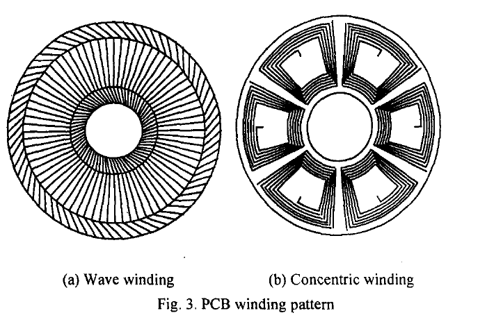

    : winding-pcb.

Concentrated Winding
^^^^^^^^^^^^^^^^^^^^^

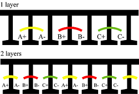

    : winding-concentrated [emetor.com].

Distributed Winding
^^^^^^^^^^^^^^^^^^^

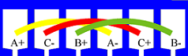

    : winding-distributed [emetor.com].

Single Layer Winding
^^^^^^^^^^^^^^^^^^^^

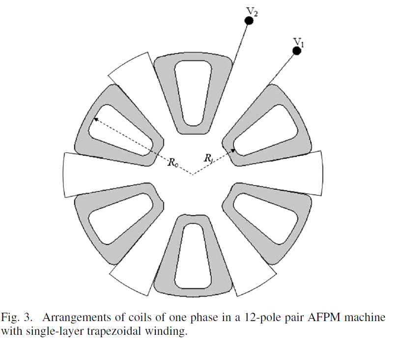

    : winding-trapezoidal.

There are different ways to do this type of winding. In this research, the single layer trapezoidal three-phase winding is used. With this type of winding, only one side of the coil is situated in a special space (or slot in the case of iron-core stator). The typical arrangement for the coils of one phase in a 12-pole pair machine is illustrated in Fig. 3. The other two phases are arranged with 120 electrical degrees with respect to the first one.

Çift Katman Sargı (Double Layer Winding)
^^^^^^^^^^^^^^^^^^^^^^^^^^^^^^^^^^^^^^^^

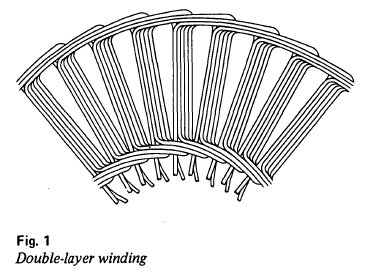

    : winding-double-layer [74].

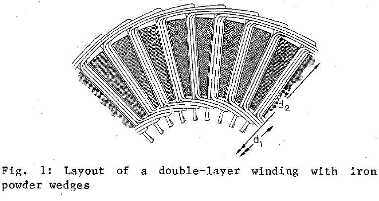

    : winding-double-layer-iron [179].

Others
^^^^^^

The coil design to be investigated in this report is patented by J.E. Brennwall [12]. The scope of the patent is a coil assembly for a three phase brushless PM axial flux multidisc machine, where the coils have machined cuts to create a flat coil arrangement. The purpose of a flat coil arrangement is to allow a compact multidisc arrangement, allow high cooling capability, and an easy assembly method. In Fig. 9, the coil design is presented. [Analysis of a Novel Coil Design for Axial Flux Machines 2013]
 
A design goal is to maximize the fill factor of the machine. [Analysis of a Novel Coil Design for Axial Flux Machines 2013]

Flat Coil Arrangement’s Advantages

- Compact multidisc arrangement
- High cooling capability
- Easy assembly method
- In the thesis; design goal is to maximize the fill factor of the machine.

Lap and Wave Winding
--------------------

In lap winding the two ends of any coil are taken to adjacent segments of the commuter and in wave windings the ends are taken to spaced segments.  A lap winding system has the same number of parallel paths as there are poles.   The wave winding system has only 2 paths in parallel [http://www.roymech.co.uk/Related/Electrics/Electrics_Direct_Current.html].

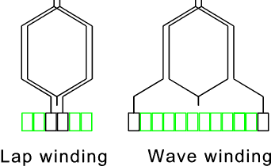

    : winding-lap-and-wave.

Lap Winding 
^^^^^^^^^^^

[http://www.electrical4u.com/lap-winding-simplex-and-duplex-lap-winding/]

Armature windings are mainly of two types – lap winding and wave winding. Here we are going to discuss about lap winding.
Lap winding is the winding in which successive coils overlap each other. It is named "Lap" winding because it doubles or laps back with its succeeding coils.

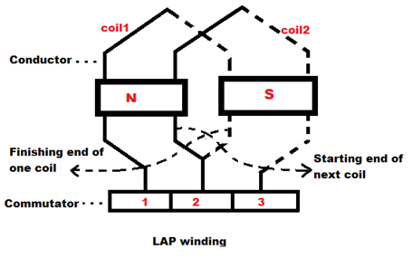

    : winding-lap.

In this winding the finishing end of one coil is connected to one commutator segment and the starting end of the next coil situated under the same pole and connected with same commutator segment.
 

Here we can see in picture, the finishing end of coil - 1 and starting end of coil - 2 are both connected to the commutator segment - 2 and both coils are under the same magnetic pole that is N pole here.

Simplex Lap Winding
^^^^^^^^^^^^^^^^^^^

A winding in which the number of parallel path between the brushes is equal to the number of poles is called simplex lap winding.

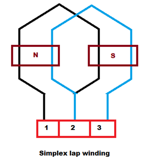

    : winding-lap-simplex.

Duplex Lap Winding
^^^^^^^^^^^^^^^^^^

A winding in which the number of parallel path between the brushes is twice the number of poles is called duplex lap winding.

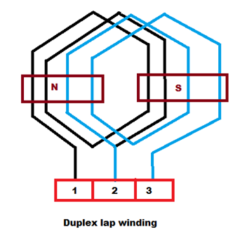

    : winding-lap-duplex.

Some important points to remember while designing the Lap winding:

If, 

- Z  = the number conductors 
- P  = number of poles 	
- YB = Back pitch 
- YF = Front pitch 
- YC  = Commutator pitch 
- YA  = Average pole pitch 
- YP  = Pole pitch 
- YR  = Resultant pitch

Then, the back and front pitches are of opposite sign and they cannot be equal.

- YB = YF ± 2m
- m = multiplicity of the winding.
- m = 1 for Simplex Lap winding
- m = 2 for Duplex Lap winding

When, 

- YB > YF, it is called progressive winding.
- YB < YF , it is called retrogressive winding.
    - Back pitch and front pitch must be odd.
	- Resultant pitch (YR) = YB - YF = 2m
- YR is even because it is the difference between two odd numbers.
    - Commutator pitch (YC) = ±m
	- Number of parallel path in the Lap winding = mP

.. rubric:: Advantages of Lap Winding

- This winding is necessarily required for large current application because it has more parallel paths.
- It is suitable for low voltage and high current generators.

.. rubric:: Disadvantages of Lap Winding

- It gives less emf compared to wave winding. This winding is required more no. of conductors for giving the same emf, it results high winding cost.
- It has less efficient utilization of space in the armature slots.

[http://www.electrical4u.com/lap-winding-simplex-and-duplex-lap-winding/]

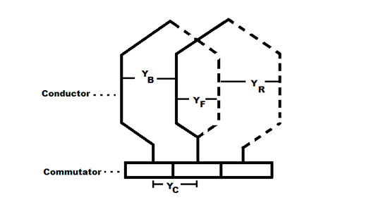

    : winding-lap-parameters.

.. rubric:: References

[1] 	R. M. J.R. Bumby, «Axial-flux permanent-magnet air-cored generator for small-scale wind turbines,» IEE Proc. Electr. Power Appl. , cilt 5, no. 152, p. 1065, 2005. 

[2] 	T. F. C. a. L. L. Lai, «An axial-flux permanent-magnet synchronous generator for a direct-coupled wind-turbine system,» IEEE TRANSACTIONS ON ENERGY CONVERSION, cilt 22, no. 1, p. 86, 2007. 

H.C. Lovatt, V.S. Ramsden, and B.C. Mecrow, "Design of an inwheel motor for a solar-powered electric vehicle," Proc. IEE-B, vol.145, no.5, pp.402-408, 1998.

Caricchi, F., F. Crescimbini, and A. Di Napoli. "Prototype of innovative wheel direct drive with water-cooled axial-flux PM motor for electric vehicle applications." Applied Power Electronics Conference and Exposition, 1996. APEC'96. Conference Proceedings 1996., Eleventh Annual. Vol. 2. IEEE, 1996.

Others
------

Nüvesiz statorlu EASM makinelerde kullanılan bir diğer bobin profili, rhomboidal (paralel kenar şeklinde) bobindir. Trapezoidal sargılara göre daha kısa son bağlantılara sahiptir. Bobinin etkin kenarlarının eğimli düzeni stator içine su soğutma kanalları yerleştirmeyi olanaklı kılar. Rhomboidal sargının kötü tarafı ise torktaki azalmadır.

# The design of electrical windings can be optimised using different criteria, such as the start-up behaviour, torque ripples or the maximum torque. [Handbook of Coil Winding p89]