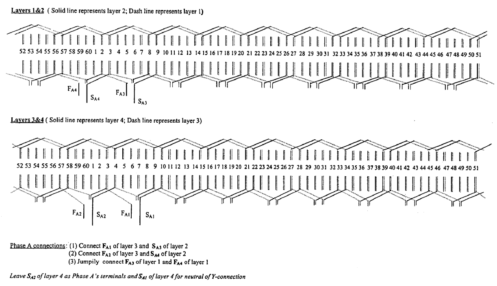

Hairpin Winding
===============

# Hairpin wound stators includes a Stator core having a number of conductors or “hairpins' 14 inserted into the slots of the Stator core. AS shown in FIG. 2, a hairpin is a Segment of wire that is used to form part of a winding. The wire Segment is bent into a “U” shape to form two legs 16 and an end-turn 18 on the “hairpin.” The wire segment typically has a rectangular cross-section. The legs of the hairpins are inserted into the slots of the stator with each leg of the hairpin in a different stator slot such that the end-turn of the hairpin extends over Several stator slots (e.g., each hairpin may extend three stator slots). Each hairpin inserted into a Stator Slot is Staggered or “interleaved' with respect to adjacent hairpins. When a hairpin is fully inserted into the slots of the stator, the end turn 18 will extend from one end of the Stator, and the legs will extend from the opposite end 19 of the stator. Any given stator slot will include a number of hairpin legs (e.g., 4), and each hairpin leg is referred to as a layer within the stator slot. Insulation 15 is included on the portion of each leg situated within a Stator slot to prevent electrical connection between the legs in different layers of the same Stator slot :cite:`patent2003connection`. 

# Once all hairpins are inserted into the slots of the stator, the ends of the legs extending from the end 17 of the Stator are bent. To reduce winding height, the legs on alternating layers are bent in opposite directions (e.g., the legs on layer one are bent counter-clockwise in the same direction and the legs on layer two are bent in the opposite direction, clockwise). The number of Stator slots that each leg is bent is determined upon the design of the electric machine (e.g., each leg may be bent three slots So that the hairpin extends a total of twelve slots from end-to-end if the end turn extends six slots). FIG.3 shows a close-up view of a typical arrangement of the hairpin legs once the legs are inserted into the slots of a Stator and bent the desired amount. As shown in FIG. 3, the legs are bent such that each leg terminates adjacent to another leg. This allows an electrical connection be easily established between each hairpin leg. In particular, once all hairpin legs are inserted into the Stator and bent, an automated connection device can be used to Weld legs together. For example, adjacent legs 21 and 22 may be welded together and adjacent legs 23 and 24 may be welded together. Similar welds would be made for other adjacent legs around the Stator. The automatic connection device may also provide insulation that covers the ends of the legs to prevent electrical shorts between two nearby legs that are not intended to be connected. The term “adjacent leg ends' is used herein to refer to two hairpin leg ends from different hairpins that are immediately adjacent to one another (such as legends 21 and 22 and 23 and 24 of FIG. 3) when the legs are bent into the proper arrangement in the Stator core. Non-adjacent leg ends are any leg ends that are not adjacent leg ends (e.g., leg ends diagonally opposed to each other such as legends 21 and 26 of FIG.3, and legends removed by Several positions Such as leg ends 21 and 27 of FIG. 3). This portion of the stator winding extending above the stator core forms the winding head 28. The term “coil end’ is also used herein to refer to the end of a conductor that requires connection to another conductor in order to form a completed winding :cite:`patent2003connection`.

    : Example winding arrangement for one phase.

Congdon et al. presented a patent that describe a connection device for use with stators having hairpin conductors. The connection device or plate arranged coil ends that have to connect different from standart welding of adjacent hairpin legs. The plate includes jumpers that connect non-adjacent hairpin legs :cite:`patent2003connection`.
