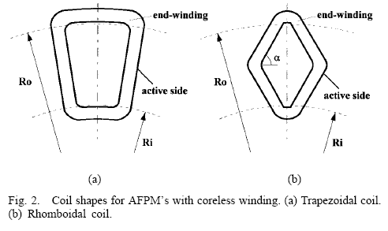
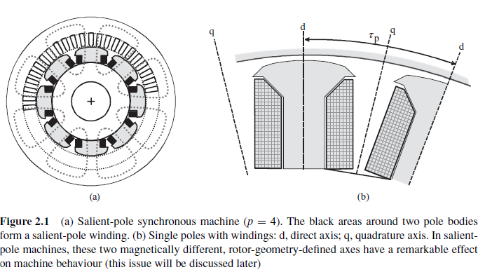

End-Winding (Sargı Sonu):
=========================
 
Yüksek hızlı indüksiyon makinelerinin sargı sonları genellikle çok uzundur,  bakır kayıplarının önemli bir kısmı burada yoğunlaşmıştır. Zautner bakır kayıplarının yaklaşık %69 unun sargı sonlarında yoğunlaştığını söylemiştir. 

    : end-winding.

Direct Axis and Quadrature Axis (d-axis and q-axis)
===================================================
 
Şekilde çıkıntı kutuplu bir makinede d ekseni ve q ekseni gösterilmiştir. [Design of Rotating Electrical Machines, Wiley, p.50]
Manyetizasyon (kutuplama) yönü seçilirken, etrafında sargı bulunan çıkıntılar tercih edilmektedir. Manyetik iletkenlik kutup ekseni boyuncadır ve d-ekseni olarak adlandırılmaktadır, kutuplar arası manyetik iletkenlik ise daha azdır, bu eksen ise q-ekseni olarak adlandırılmaktadır [Electric Machinery, McGraw Hill, p.282]. Kutup ekseni direct axis olarak adlandırılmaktadır. İki kutup arası ise quadrature axis olarak adlandırılmaktadır.

    : dq-axis.

Elektromotif Kuvvet
===================

Akım (etkin elektronlar ve iyonlar) akmasına neden olan kuvvete elektromotif kuvvet adı verilmektedir. Daha genel olarak, elektromotif kuvvet, iki açık devre terminal arasında elektrik potansiyel farkı oluşturmak için sarfedilen birim başına yük miktarıdır. Elektrik potansiyel farkı bölünen pozitif ve negatif yükler tarafından yaratılır, böylece elektrik alan da oluşturulur. Eğer bir devre emk kaynağına bağlanırsa, yaratılan bu elektrik potansiyel farkı akım akmasına sebep olur. Ancak akım aktığında, emk kaynağının terminalleri açık devre kalamaz, bağlanan devrenin iç direnci dolayısıyla, devre üzerinde bir gerilim düşümü gerçekleşir [http://en.wikipedia.org/wiki/Electromotive].

Pole pitch
==========

Suppose we have a N-pole electrical machine, then the angular distance between the consecutive poles when expressed in degrees is POLE PITCH.
eg. for a two pole machine (one north and one south pole), the pole pitch is 180 degrees, and for a 4-pole machine: it is 90 degrees.
Note that this is so when expressed in Mechanical degrees, whereas in Electrical degrees it is always 180 degrees.
Therefore:
POLE PITCH (mechanical)=180/(n/2): n=no pf poles.

Pole Pitch:

- pole pitch = distance between centers of two adjacent poles (ex. Two ploe machine: 180o)
- coil pitch = distance between two sides of a coil
- full-pitch: coil pitch = pole pitch
- short-pitch: coil pitch < pole pitch (mainly in ac-machines)

Magnetic Reluctance
===================

Magnetic reluctance, or magnetic resistance, is a concept used in the analysis of magnetic circuits. It is analogous to resistance in an electrical circuit, but rather than dissipating magnetic energy it stores magnetic energy. In likeness to the way an electric field causes an electric current to follow the path of least resistance, a magnetic field causes magnetic flux to follow the path of least magnetic reluctance. It is a scalar, extensive quantity, akin to electrical resistance.

The term was coined in May 1888 by Oliver Heaviside[1]. The notion of “magnetic resistance” was first mentioned by James Joule[2] and the term "magnetomotive force” (MMF) was first named by Bosanquet[3]. The idea for a magnetic flux law, similar to Ohm's law for closed electric circuits, is attributed to H. Rowland[4].

The total reluctance is equal to the ratio of the "magnetomotive force” (MMF) in a passive magnetic circuit to the magnetic flux in this circuit. In an AC field, the reluctance is the ratio of the amplitude values for a sinusoidal MMF and magnetic flux. (see phasors)

The definition can be expressed as:

.. math::

    R=F/\Phi

where

 ("R") is the reluctance in ampere-turns per weber (a unit that is equivalent to turns per henry). "Turns" refers to the winding number of an electrical conductor comprising an inductor.

 ("F") is the magnetomotive force (MMF) in ampere-turns

Φ ("Phi") is the magnetic flux in webers.

It is sometimes known as Hopkinson's law and is analogous to Ohm's Law with resistance replaced by reluctance, voltage by MMF and current by magnetic flux.

Magnetic flux always forms a closed loop, as described by Maxwell's equations, but the path of the loop depends on the reluctance of the surrounding materials. It is concentrated around the path of least reluctance. Air and vacuum have high reluctance, while easily magnetized materials such as soft iron have low reluctance. The concentration of flux in low-reluctance materials forms strong temporary poles and causes mechanical forces that tend to move the materials towards regions of higher flux so it is always an attractive force(pull).

The reluctance of a uniform magnetic circuit can be calculated as:

.. math::

    R=l/(\mu_0\mu_r A)

or

.. math::

    R=l/\mu A

where

l is the length of the circuit in metres

μ0 is the permeability of free space, equal to  henry per metre

μr is the relative magnetic permeability of the material (dimensionless)

μ is the permeability of the material (μ = μ0μr)

A is the cross-sectional area of the circuit in square metres

The inverse of reluctance is called permeance.

.. math::

    P=1/R

