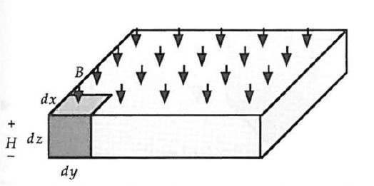
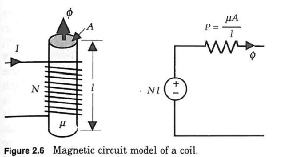
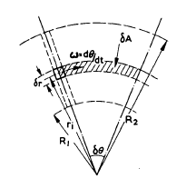

Enerji Dönüşümü
===============

Manyetik Devre Kavramı

Temel İlişkiler
---------------

İki vektör bileşeni B ve H manyetik alanı ifade eder. Akı yoğunluğu B, belirli bir malzeme alanından geçen manyetik alan miktarıdır. Alan şiddeti H ise malzeme ile B akı yoğunluğunun etkileşimi sonucu ortaya çıkan manyetik alan şiddetindeki değişimdir. Motor tasarımındaki manyetik malzemeler için B ve H arasındaki ilişki doğrusaldır. Yani verilen malzeme için ikisi de aynı doğrultudadır. Şekil 2.1'de bu ilişki görülmektedir [e0101]. 

    : Şekil 2.1  Uzunluğu olan manyetik bir malzeme. 

B ve H arasındaki ilişki, malzemenin çok değerli fonksiyonu dolayısıyla, aslında doğrusal değildir. Buna rağmen bir çok makinede çok geniş bir çalışma aralığında bu doğrusal yaklaşım yeterlidir. Bu B ve H arasındaki ilişki şu şekilde yazılabilir: 

.. math::

    B=\mu H

μ malzemenin manyetik geçirgenliğidir. 

İki temel eşitlik manyetik devre modeli analizinin yapılabilmesini sağlar. Bunlardan biri akı yoğunluğundan akı ifadesidir, diğeri ise alan şiddetinden manyetomotif kuvvet (mmk) ifadesidir.

Belirli bir hacimden geçen toplam akıyı bulmak için bu hacim üzerinde manyetik akı yoğunluğunun integrali alınır:

.. math::

    \phi=\int{B_z\left(x,y\right)dxdy}

Burada genel olarak <b sabit ve hacim içinde homojen olarak dağıldığı varsayılır. Böylece integral ifadesi basit doğrusal bir eşitliğe indirgenir.

.. math::

    \phi=BA

Burada A yüzey alandır. Uluslararası birim sistemine (SI) göre B Wb/m2 veya Tesla (T) olarak, φ'de Wb olarak verilmektedir. Böylece ilk eşitlik elde edilmiş olur. 

Şimdi z doğrultusu boyunca değişimi inceleyecek olursak, \phi akısı z doğrultusunda akmaktadır ve manyetik alan şiddetinde bir değişim yaratır. Manyetik alan şiddetindeki bu toplam değişime manyetomotif kuvvet (emk veya mmf) adı verilir. 

.. math::

    F=\int H d z=Hl

Burada H'nin birimi A/m'dir ve mmf'in birimi A olur. Böylece manyetik devre analizinin ikinci denklemi elde edilmiş olur.

Elde ettiğimiz bu iki eşitliği birleştirirsek:

.. math::

    \phi=PF

.. math::

    P=\frac{\mu A}{l}

Burada elde edilen \mu geçirgenliğe sahip, l uzunluğunda ve A yüzey alanına sahip bir malzemenin manyetik iletkenliğidir. Manyetik iletkenliğin birimi Wb/A veya Henry (H)'dir [e0101].

Manyetik iletkenliğin tersi ise manyetik dirençtir:

.. math::

    R=\frac{1}{P}=\frac{l}{\mu A}

Manyetik Alan Kaynakları
------------------------

İki temel manyetik alan kaynağı vardır; bunlardan ilki bir tel içerisinden geçen akım, diğeri ise sürekli mıknatıs. 
 

    : Şekil 2.2 Bir sargının manyetik devre modeli.

Akım geçen bir telin oluşturduğu manyetik alan Ampere Yasası ile bulunabilir. 

.. math::

    \oint_{C}{\vec{H}\bullet\vec{dl}}=I

Manyetik alan şiddeti H'nin yönü sağ el kuralı ile belirlenir. Sağ elin başparmağı akımın yönüne çevrilirse diğer parmaklar yumruk yapıldığında manyetik alan şiddetinin yönünü göstermektedir. 

Yüksek bir manyetik geçirgen malzemenin (nüve veya çekirdek) etrafına N tur sargı yapıldığında eşitlik şu şekilde yazılabilir.

.. math::

    NI=\int_{a}^{b}Hdz=Hl

Manyetostatik Alanlar için Sınır Koşulları[e0201]
-------------------------------------------------

Farklı fiziksel özelliklere sahip ortamlar bulunan bölgelerdeki manyetik alan problemlerini çözmek için sınır koşullarını çalışmak gerekir. B ve H vektörleri farklı ortamlar arasındaki etkileşimde sağlanmalıdır. 

Hava Aralığındaki Elektromotif Kuvvet (emf)
--------------------------------------------

    : Şekil 2.3 EASM makinede etkin alanının bileşenleri.

Yukarıdaki şekilde temel bir EASM makinenin etkin alanının bir kesiti görülmektedir. Eksenel akılı makinelerde etkin alan R1 yarıçapı ile R2 yarıçapı arasında kalan bölgedir [74]. Mıknatısların süpürdüğü bu alanın tam karşısında sargılar farklı yapılarda yerleştirilebilmektedir. 

Geleneksel makinelerde iletkenlerdeki emk'yı hesaplamak için bir kutup adımı boyunca etkin akı yoğunluğunun ortalaması kullanılmaktadır. Bu yöntem disk armatürlü makinelerde kullanılamamaktadır [74].

Şekil 2.3'de armatür iletkeninin bileşenleri görülmektedir. Radyal ve açısal pozisyonu sırasıyla i ve j ile gösterilmektedir. İletkenin açısal hızı ω'dır. İletken tarafından kesilen akı dA alanı boyunca süpürülmektedir. Böylece akı şu şekilde yazılabilir [74]:

.. math::

    d\Phi_{i,j}=B_{i,j}r_idrd\theta

İletkendeki emk şu şekildedir:

.. math::

    e_{i,j}=B_{i,j}r_idrd\theta/dt

Böylece iletken üzerindeki j açısal pozisyonu boyunca emk bulunabilir.

.. math::

    e_j=\omega\int_{r_i=R_1}^{R_2}{B_{i,j}r_idr}

Akı yoğunluğunun yarıçapa bağlılığını ortadan kaldırmak uygun olacaktır, yani integrasyon uygulanabilir. Bu bağlılığı kaldırmak sadece Bi,j'nin yarıçap üzerinden integrali alınabilmesiyle mümkün olabilmektedir. Emk'nın formülasyonu

.. math::

    e_j=\frac{\omega B_j}{2}\left(R_2^2-R_1^2\right)

olur ve Bj şöyle yazılır:

.. math::

    B_j=\frac{2}{R_2^2-R_1^2}\int_{r_i=R_1}^{R_2}{B_{i,j}r_idr}

Denklem 5'den görüleceği üzere, verilen bir akı yoğunluğunun iletkendeki emk'e katkısı yarıçap ile orantılıdır. Çünkü lineer hız yarıçap değiştikçe değişmektedir [74]. Ortalama lineer hız v olarak alınırsa denklem şu hali alır:

.. math::

    e_j=B_jlv

.. math::

    l=R_2-R_1\ ,\ v=\frac{R_2+R_1}{2}\omega

Akı Yoğunluğunun Momenti
------------------------

Geleneksel DA makinelerinin hesaplamalarından sapma olduğu için B_{i,j} ile r_i birbirinden bağımsız yazılamamaktadır. Bu akı yoğunluğunun momentini (Pj) tanımlanmasına neden olmaktadır [74].

.. math::

    P_j=\frac{1}{R_2-R_1}\int_{r_i=R_1}^{R_2}{B_{i,j}r_idr}

Bu hesaplama etkin yarıçap üzerindeki akı yoğunluğunun B_{i,j}r_i ortalamasını vermektedir. Denklem 3'de verilen iletken emk'i şu hale gelir:

.. math::

    e_j=P_jl\omega

Bu, eksenel akılı makinelerde iletken emk'inin uygun bir ortalama alındığıu zaman sadeleştirilebileceğini göstermektedir. Ancak bu akı yoğunluğunun değil, akı yoğunluğu momentinin ortalamasıdır.

Artık bir kutup adım aralığında ortalama iletken emk'i Ec bulunabilmektedir. 

.. math::

    E_c=\frac{pl\omega}{2\pi}\int_{0}^{2\pi/p}{P_jd\theta}

Sonuç olarak bulunan bu Pj'nin ortalaması açısal pozisyondan bağımsız diğer bir akı yoğunluğu momenti P'nin tanımlanmasını sağlamaktadır.

.. math::

    P=\frac{p}{2\pi(R_2-R_1)}\int_{0}^{2\pi/p}{\int_{R_1}^{R_2}{B_{i,j}r_idr}d\theta}

Bundan dolayı

.. math::

    E_c=Pl\omega

P bir kutup adımı boyunca akı yoğunluğunun B_{i,j}r_i ortalamasıdır. Disk makine için kutup başına toplam akıyı hesaplanabilmektedir.

.. math::

    \phi=\frac{2\pi lP}{p}

