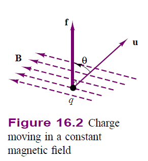

Lorentz Force Law
*****************

#The quantities used to quantify the strength of a magnetic field are the magnetic flux, φ, in units of webers (Wb); and the magnetic flux density, B, in units of webers per square meter (Wb/m2), or teslas (T). The latter quantity, as well as the associated magnetic field intensity, H (in units of amperes per meter, or A/m) are vectors.1 Thus, the density of the magnetic flux and its intensity are in general described in vector form, in terms of the components present in each spatial direction (e.g., on the x, y, and z axes). In discussing magnetic flux density and field intensity in this chapter and the next, we shall almost always assume that the field is a scalar field, that is, that it lies in a single spatial direction. This will simplify many explanations. It is customary to represent the magnetic field by means of the familiar lines of force (a concept also due to Faraday); we visualize the strength of a magnetic field by observing the density of these lines in space. You probably know from a previous course in physics that such lines are closed in a magnetic field, that is, that they form continuous loops exiting at a magnetic north pole (by definition) and entering at a magnetic south pole. The relative strengths of the magnetic fields generated by two magnets could be depicted as shown in Figure 16.1. 
 
#Magnetic fields are generated by electric charge in motion, and their effect is measured by the force they exert on a moving charge. As you may recall from previous physics courses, the vector force f exerted on a charge of q moving at velocity u in the presence of a magnetic field with flux density B is given by the equation [Rizzoni G., 2005]

.. math::

    F = qu\times B

#where the symbol × denotes the (vector) cross product. If the charge is moving at a velocity u in a direction that makes an angle θ with the magnetic field, then the magnitude of the force is given by

.. math::

    F=quB\sin{\theta}

#and the direction of this force is at right angles with the plane formed by the vectors B and u. This relationship is depicted in Figure 16.2 [Rizzoni G., 2005].

    : lorentz-law-rizzoni.

**The Lorentz Force Law [Fitzgerald et al., 2003]**

.. math::

    F = q (E+v\times B)

#gives the force F on a particle of charge q in the presence of electric and magnetic fields. In SI units, F is in newtons, q in coulombs, E in volts per meter, B in teslas, and v, which is the velocity of the particle relative to the magnetic field, in meters per second [Fitzgerald et al., 2003].

Thus, in a pure electric-field system, the force is determined simply by the charge on the particle and the electric field

.. math::

    F = qE

#The force acts in the direction of the electric field and is independent of any particle motion [Fitzgerald et al., 2003].

In pure magnetic-field systems, the situation is somewhat more complex. Here the force

.. math::

    F = q( v\times B )

#is determined by the magnitude of the charge on the particle and the magnitude of the B field as well as the velocity of the particle. In fact, the direction of the force is always perpendicular to the direction of both the particle motion and that of the magnetic field. Mathematically, this is indicated by the vector cross product v × B in Eq. (5). The magnitude of this cross product is equal to the product of the magnitudes of v and B and the sine of the angle between them; its direction can be found from the fight-hand rule, which states that when the thumb of the fight hand points in the direction of v and the index finger points in the direction of B, the force, which is perpendicular to the directions of both B and v, points in the direction normal to the palm of the hand, as shown in Fig. 3.1 [Fitzgerald et al., 2003]. 
 
#For situations where large numbers of charged particles are in motion, it is convenient to rewrite Eq. (3) in terms of the charge density p (measured in units of coulombs per cubic meter) as

.. math::

    F_v = \rho (E+v\times B)

#where the subscript v indicates that Fv is a force density (force per unit volume) which in SI units is measured in newtons per cubic meter [Fitzgerald et al., 2003]. 

#The product :math:`\rho v` is known as the current density

.. math::

    J = \rho v

#which has the units of amperes per square meter. The magnetic-system force density

.. math::

    F_v = J\times B

#For currents flowing in conducting media, Eq. above can be used to find the force density acting on the material itself. Note that a considerable amount of physics is hidden in this seemingly simple statement, since the mechanism by which the force is transferred from the moving charges to the conducting medium is a complex one [Fitzgerald et al., 2003].

Lomheim, 2003

The strength of the force producing the torque is given by

.. math::

    F = qv\times B

#where :math:`F` is the force resulting from the magnetic field :math:`B` acting on current :math:`qv`. In an electrical machine the force is acting in the circumferential direction, which means that the current and magnetic fields are confined to the radial and axial directions which lead to the two machine types [Lomheim, 2003].

References

- Rizzoni, Giorgio. Principles and applications of electrical engineering. McGraw-Hill Science/Engineering/Math, 2005.
- Fitzgerald, Arthur Eugene, Charles Kingsley, and Stephen D. Umans. Electric machinery. Vol. 5. New York: McGraw-Hill, 2003.
- Lomheim, Sigbjørn. "Analysis of a Novel Coil Design for Axial Flux Machines." (2013).
