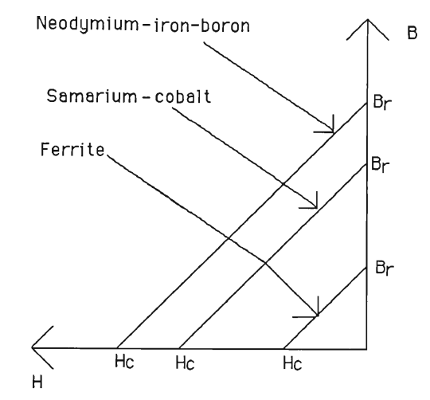

Others
******

Force on a current carrying conductor in a magnetic field is

.. math::

    F = BLI

where B is the flux density, L is the length of the conductor, and I is the current through the conductor and and B, I, F are mutually perpendicular.

Permanent magnets usually operate in the second quadrant of the B-H loop which is called the demagnetising curve of the magnet. A permanent magnet material is characterized by its remanence (Br) and the coercivity (Hc) which can be directly read from the demagnetisation curve. Figure 1.9 shows the demagnetisation curve of some permanent magnets, and the Table 1.1 shows the values of B r and H c for the magnets.

Equation (1.1) suggests that the torque developed by the machine is directly proportional to the flux density in the airgap, B. B is directly proportional to the remanance of the magnet (the actual relationship between B and B r is derived in the next chapter). Hence if a magnet material with high remanence is used then the machine will produce high torque.

    : Figure 1.9 Demagnetisation curves.

    : Table 1.1 Remanence and coercivity of permanent magnet materials.

 